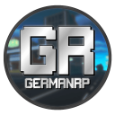

 

  

<h2><b>Willkommen im GermanRP Wiki!</b></h2>

Willkommen im offiziellen Wiki von GermanRP. In diesem Wiki findest du viele Antworten auf Fragen,
die während des Spielens aufkommen.

Wir wünschen dir viel Spaß auf deiner Entdeckungstour!

  

<h3>Nützliche Links</h3>

    

        <a href="pages/help/anfängerhilfe/">Anfängerhilfe</a>
    

    

        <a href="pages/nebenjobs/nebenjobs/">Nebenjobs</a>
    

    

        <a href="pages/allgemein/essen/">Nahrung</a>
    

       

