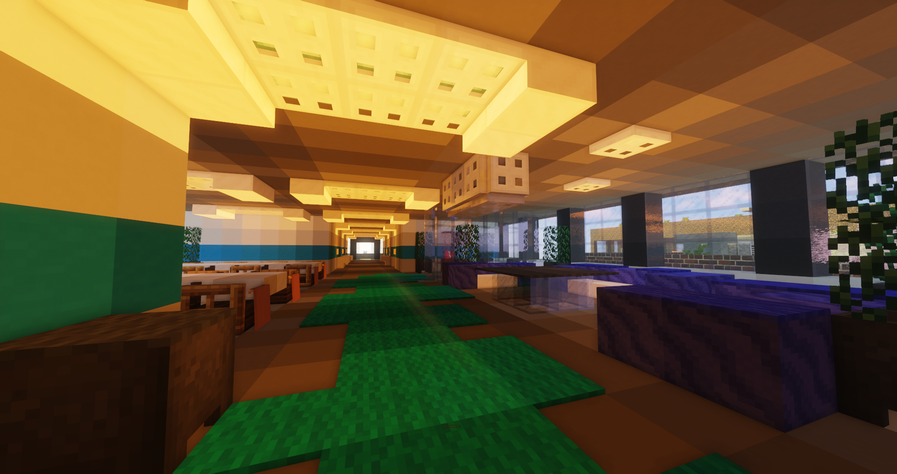

# Bewusstlosigkeit

Sobald der Zustand der Bewusstlosigkeit erreicht ist, erfolgt eine Teleportation in den Todenraum des Krankenhauses. Für **8 Minuten** ist man in diesem Raum, mit [VIP] nur **5 Minuten**. In der Zeit hat ein [Rettungsdienstler] die Möglichkeit, die Person wiederzubeleben.

## Wiederbelebung durch einen Medic
Der Medic kann einen durch einen Befehl wiederbeleben. Gelingt diese, erwacht man an der Stelle, wo die Bewusstlosigkeit eingetreten ist und kann unter Berücksichtigung des [Regelwerks](https://germanrp.eu/forum/index.php?thread/1-regelwerk/&postID=3#post3) am Spielgeschehen teilnehmen.

## Despawn ohne Wiederbelebung
Ist die Wiederbelebung nach 5 Minuten nicht gelungen, despawnt die Leiche und wird Despawnen. Man erwacht wieder im Krankenhaus und verliert im Zuge dessen ein Charakterleben. Nachdem Tod gilt die Newlife Regel des [Regelwerks](https://germanrp.eu/forum/index.php?thread/1-regelwerk/&postID=3#post3). Alle Ereignisse die zur Bewusstlosigkeit geführt haben, können sich nicht mehr dran erinnert werden.
