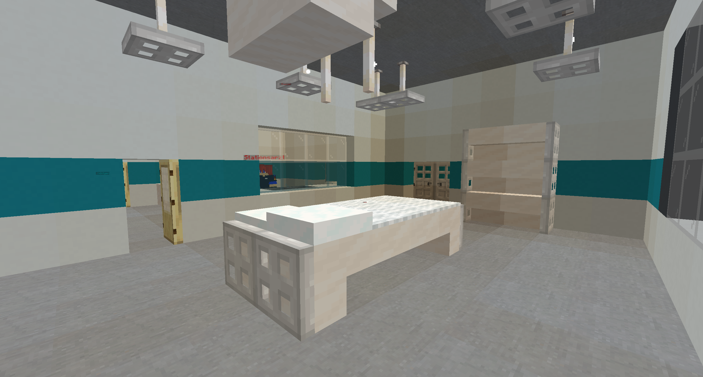

# Bewusstlosigkeit

Sobald der Zustand der Bewusstlosigkeit erreicht ist, erfolgt eine Teleportation in den Totenraum des Krankenhauses. Für **8 Minuten** bleibt man in diesem Raum, mit [VIP](../../pages/allgemein/vip.md) nur **5 Minuten**. In dieser Zeit hat ein [Rettungsdienstler](../../pages/fraktionen/rettungsdienst.md) die Möglichkeit, die Person wiederzubeleben.

## Wiederbelebung durch einen Medic

Der Medic kann eine Person durch einen Befehl wiederbeleben. Gelingt dies, erwacht man an der Stelle, an der die Bewusstlosigkeit eingetreten ist, und kann unter Berücksichtigung des [Regelwerks](https://germanrp.eu/forum/index.php?thread/1-regelwerk/&postID=3#post3) am Spielgeschehen teilnehmen.

## Despawn ohne Wiederbelebung
Ist die Wiederbelebung nach 5 Minuten nicht gelungen, despawnt die Leiche. Man erwacht im Krankenhaus und verliert dabei ein [Charakterleben](../../pages/krankheiten/gesundheit.md). Mit einem [Hund](../../pages/pets/hund.md) kann die Wahrscheinlichkeit erhöht werden, kein Charakterleben zu verlieren. Nach dem Tod gilt die Newlife-Regel des [Regelwerks](https://germanrp.eu/forum/index.php?thread/1-regelwerk/&postID=3#post3). Alle Ereignisse, die zur Bewusstlosigkeit geführt haben, können nicht mehr erinnert werden.

