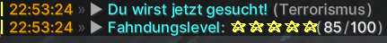

# Fahndungspunkte

## Allgemeines
Die Fahndungspunkte oder auch Wantedpoints (WPS) werden von der Fraktion Polizei vergeben, sobald ein Spieler eine Straftat begangen hat. Eine Straftat begeht man, sobald gegen das Strafgesetzbuch verstoßen wird. Der [Buß- und Strafkatalog](https://germanrp.eu/forum/index.php?thread/831-wichtig-bu%C3%9F-und-strafkatalog/) kann im Forum jederzeit eingesehen werden. Die Fandungspunkte erstrecken sich von 1 bis 100, wobei 100 die höchste Anzahl an Fahndungspunkten ist. Die Fahndung wird außerdem noch in Sternen angezeigt. Je mehr Sterne man hat, desto höher ist das Strafmaß. Ab 65 Fahndungspunkten oder 3 Sternen gilt man als Schwerverbrecher.

## Einsehen der Fahndungspunkte
Die Polizei hat die Möglichkeit alle aktiven Fahndungen mit dem Befehl **/wanteds** oder **/fahndungen** einzusehen. Seine eigene Fahndung kann unter den Statistiken abgerufen werden. Man sieht ebenfalls oben auf seinem Bildschirm das man gesucht wird.

## Möglichkeiten der Strafverfolgung
Wird nach einem Spieler gefahndet gibt es mehrere Möglichkeiten der Strafverfolgung. Zum Einen kann sich der Spieler selber bei einem Beamten stellen, indem man einen [Notruf](../../pages/allgemein/notrufe.md) absetzt. Für eine Stellung wird eine Strafminderung erteilt.

Möchte man sich als Verbrecher nicht stellen, sollte man sich stets bedeckt und versteckt vor Polizisten halten. Mit der Zeit wird es aber immer schwerer der Polizei zu entkommen und einer Verhaftung aus dem Weg zu gehen, sodass man um diese nicht drumherum kommt.

Fährt ein Schwerverbecher mit dem Bus, erhalten die Polizisten eine Nachricht mit der Zielhaltestelle des Verbrechers:

