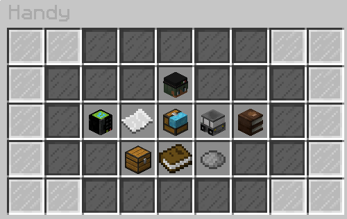

# Mobiltelefon (Handy) 

Das Handy hat verschiedene Funktionen wie zum Beispiel Telefonieren, SMS schreiben und Kontakte einspeichern. Zusätzliche Apps kann man sich im App Store herunterladen. Darunter befinden sich das Telefonbuch und die Handelshaus App. Ebenso kann bei einem vorhandenen [Anwalt](../../pages/gebäude/anwaltskanzlei.md), dieser anrufen werden, wenn man in der [Justizvollzugsanstalt](../../pages/gebäude/jva.md) sitzt.

| App | Kosten |
|:-:|:-:|
| Handelshausapp | 6.00€ | 
| Telefonbuch | 3.00€ |

## Handyvertrag

Um die ganzen Funktionen eines Handys nutzen zu können, benötigt man einen Handyvertrag, welcher im Elektroladen erwerbar ist. Dieser befindet sich in [Downtown](../../pages/gebiete/downtown.md), gegenüber der [Apotheke](../../pages/biz/apotheke.md)-1. Alternativ kann das **/navi Elektroladen** verwendet werden. Es gibt zwei verschiedene Verträge, welche sich in Abrechnung-, SMS und Anrufkosten und maximalen Kontakten unterscheiden. Nachdem ein Vertrag abgeschlossen wurde, wird einem eine Nummer zugewiesen. Diese ist ziemlich einfach aufgebaut: Sie fängt für alle mit +43 15244 an. Dann folgen drei Zahlen, die einem Spieler zugeordnet sind. **Beispiel**: +43 15244 582.

| Vertrag | Kosten pro Abrechnung | SMS | Anruf | Kontaktplätze
|:-:|:-:|:-:|:-:|:-:|
| Basisvertrag | 2.40€ | 0.19€ | 2.00€ | 5 |
| Erweiterter Vertag | 7.60€ | 0.08€ | 0.75€ | 10 |

## Funktionen des Handys

Mit **/handy** öffnet sich das Handymenü. Hier finden sich verschiedene Köpfe und Items. Der eigende Spielerkopf zeigt einem den Vertrag und seine Nummer. Darunter sind die verschiedenen Funktionen. Im ersten Slot befindet sich das Nummernfeld, wo die Notrufnummern stehen. Daneben ist ein einfaches Papier zu sehen, welche die Funktion SMS schreiben umfasst. Hierfür wird vorrausgesetzt, dass man die Person als Kontakt eingespreichert hat um eine SMS zu schreiben. Die Kiste symbolisiert den Appstore, wo zwei verschiedene Apps installiert werden können. Ebenso symbolisiert der Autokopf die Fahrzeugortung. Hier kann das Fahrzeug geortet werden und es richtet sich automatisch ein Navi zum Auto aus. Im Buchkopf befindet sich die Kontaktliste, wo man sich seine eigenen Kontakte einspeichern und auswählen kann. Hat man die Handelshaus App, wird einem eine Nachricht gesendet, wenn es ein neues Angebot im Handelshaus gibt.

### Kontakte einspeichern

In der Kontaktliste befindet sich ein grüner Knopf, wo ein neuer Kontakt erstellt werden kann. Im Chat kommt die Aufforderung die Nummer des Kontaktes reinzuschreiben. Hierbei ist es wichtig zu beachten, dass man die Vorwahl und Leerzahlen korrekt eingibt. Danach muss ein Name eingegeben werden. Jetzt ist der Kontakt erfolgreich eingespeichert und wird nun in der Kontaktliste als ein Papier angezeigt. Mit Linksklick kann der Kontakt angerufen werden und mit einem Rechtsklick wird dieser gelöscht.

### Telefonieren 

Zum Telefonieren gibt es zwei Optionen. Diese sind einmal über das Nummernfeld oder, wenn vorhanden, über die Kontaktliste. Über das Nummerfeld, benötigt man zuerst eine Nummer. Diese wurde einem im Roleplay mitgeteilt oder man findet diese, wenn die besagte Person, die Telefonbuch-App heruntergeladen hat, unter dem Befehl **/nummer [Spielername]**. So gibt man die Nummer entsprechend mit Tastenfeld ein und ruft diese an. Die Person, die dann den Anruf erhält, bekommt ein akustisches Signal und eine Nachricht in den Chat, dass sie einen Anruf von der Nummer +43 15244260 (Beispiel) erhält. Mit dem Befehl **/handy** öffnet sich dann ein Menü, wo der Anruf angenommen oder abgelehnt werden kann. Das Gespräch läuft über den Ingame Chat ab und andere Personen im unmittelbaren Umfeld können ebenso das Telefongespräch mitbekommen. Möchte man am Ende des Gespräches auflegen, wird dies über den gleichen Befehl mit **/handy** getan. Es öffnet sich ein Menü, wo der Anruf beendet werden kann. 

### SMS senden 

Eine SMS kann nur an Kontakte gesendet werden. Im Handymenü stellt das papier die SMS Funktion dar. Wird dies angeklickt, kann zunächst zwischen den Kontakten gewählt werden. Im Chat kommt eine Aufforderung die Nachricht zu schreiben.

