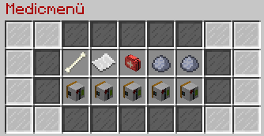
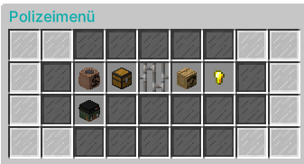
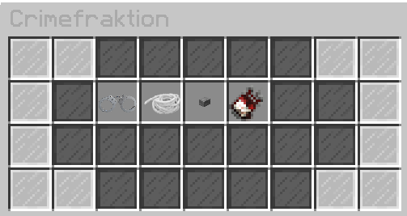

# Interaktionsmenü

Das Interaktionsmenü bietet eine Vielzahl an Möglichkeiten, um mit Spielern zu interagieren. Man öffnet es, indem man mit Rechtsklick auf einen anderen Spieler klickt.

## Inhalte des Interaktionsmenüs

| Inhalt | Funktion |
|:-:|:-:|
| Fraktionsinfo | Zeigt, in welcher Fraktion der Spieler ist. |
| Informationen | Zeigt die verschiedenen [Skill-Level](../../pages/skills/allgemein.md). |
| Haustier | Zeigt das aktuell ausgerüstete [Pet](../../pages/pets/allgemein.md) des Spielers. |
| Dokumente zeigen | Zeige dem Spieler deine [Lizenzen](../../pages/allgemein/lizenzen.md). |
| Tascheninhalt zeigen | Zeige dem Spieler den [Tascheninhalt](../../pages/allgemein/tasche.md). |
| Finanzen | Zeige dem Spieler deine Finanzen (Bargeld & Konto). |
| Personalausweis zeigen | Zeige dem Spieler deinen Personalausweis. |
| Küssen | Küsse den Spieler. |
| Geld geben | Gib dem Spieler Geld. |

## Fraktionsspezifische Interaktionsmenüs

Für Fraktionsmitglieder gibt es zusätzliche Interaktionen:

  

| Fraktion | Funktionen |
|:-:|:-:|
| [Rettungsdienst](../../pages/fraktionen/rettungsdienst.md) | Allgemeinzustand überprüfen; Arztbericht anfertigen; Erste-Hilfe-Kurs attestieren; Gesundheitscheck attestieren |
| [Polizei](../../pages/fraktionen/polizei.md) | Bußgeld ausstellen; Durchsuchen; Transport anfordern; Fahndungsinfo abrufen; Dienstmarke zeigen; Zu Boden drücken |
| [Crimefraktionen](../../pages/fraktionen/allgemein.md) | Packen; Fesseln; Knebeln; Kommunikationsmittel abnehmen |
