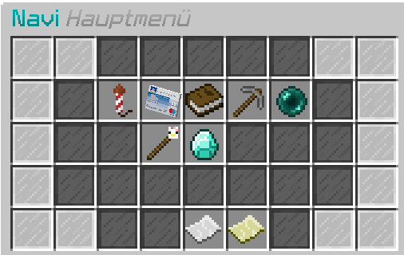

# Navigation

Mit dem Befehl **/navi** öffnet sich ein Menü, das Routenführungen zu den wichtigsten Punkten der Stadt startet. Alternativ ist es möglich, im Chat nach einem Leerzeichen nach **/navi** alle möglichen Navipunkte zu tabben. Wählt man in dem Menü ein Ziel aus, wird einem ein Kompass  ins Inventar gelegt, dem man folgen kann oder – sollte die Einstellung aktiv sein – ein Strahl in die Richtung des Navipunktes gezeigt. Zudem ist es im **/navi**-Menü möglich, mit VIP einen persönlichen Navipunkt zu speichern, nach Orten zu suchen oder die aktuelle Position auf der [Livemap](https://map.germanrp.eu) anzusehen.

