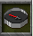
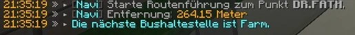

# Navigation

Mit dem Befehl /navi öffnet sich ein Menü, welches Routenführungen zu den wichtigsten Punkten der Stadt startet. Wählt man in dem Menü ein Ziel aus, wird einem ein Kompass  in das Inventar gelegt, welchem man folgen kann.

## Öffentliche Punkte

| Navipunkt | Orte in der Nähe |
|:-:|:-:|
| Stadthalle | - Apotheke-1   - Starblocks-1   - Postzentrale  |
| Zentralbank | - Apotheke-1   - Bar-3   - Rathaus   -Starblocks-1   - Postzentrale |
| Maklerbüro | - Polizeipräsidium |
| Gärtnerei | - Bar-1   - Restaurant   - Farm |
| Justizvollzugsanstalt | - Labor |
| Rathaus | - Stadthalle   - Postzentrale   - Standesamt   - Bürgermeisterwahl |
| Jagdhütte | - Farm   - Schwarzmarktauktion   - Weinberg |
