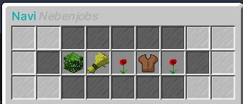

# Navigation

Mit dem Befehl /navi öffnet sich ein Menü, welches Routenführungen zu den wichtigsten Punkten der Stadt startet. Wählt man in dem Menü ein Ziel aus, wird einem ein Kompass  in das Inventar gelegt, welchem man folgen kann.

## Wichtige Orte

| Navipunkt | Orte in der Nähe |
|:-:|:-:|
| Stadthalle | - Apotheke-1   - Starblocks-1   - Postzentrale  |
| Zentralbank | - Apotheke-1   - Bar-3   - Rathaus   -Starblocks-1   - Postzentrale |
| Rathaus | - Stadthalle   - Postzentrale   - Standesamt   - Bürgermeisterwahl |
| Fahrzeughändler |- Postzentrale |
| Luxusfahrzeughändler | - Supermarkt-7 |
| Helikopterflugplatz | - Bar-2 |

## Gewerbe

| Navipunkt | Konsumgüter |
|:-:|:-:|
| Waffenladen | - Waffen   - Munition  |
| Supermarkt | - Apäfel   - Fleisch   - Wasser  |
| Bar | - Cola   - Limonade  |
| Starblocks | - Kaffe   - Donuts  |
| Apotheke | - Bandagen   - Nasensalbe   - Hustenbonbons  |
| Tankstelle | - Sandwich   - Kanister   |

## Fraktionsbasen

| Navipunkt |
|:-:|
| Polizeipräsidium |
| Polizeirevier-West |
| Polizeirevier-Süd |
| Uniklinik |
| Krankenhaus-West |
| Krankenhaus-Süd |
| Feuerwehr |
| Medellín Kartell |
| Sinaloa Kartell |
| Yakuza  |
| Establishment |
| Camorra |

## Nebenjobs

| Navipunkt | Nebenjob |
|:-:|:-:|
| Weinberg | - Winzer |
| Farm | - Farmer |
| Gärtnerei | - Gärtner |
| Wäscherei | - Wäscherei |
| Blumenladen | - Blumentransport |

## Orte in der Nähe

| Navipunkt |
|:-:|
| Bushaltestelle |

## Sonstige Orte

Hier werden alle Orte aufgeführt die nicht unter einen der anderen Punkte zählt
