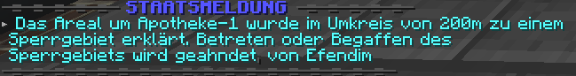

# Sperrgebiete
Ein Sperrgebiet ist ein virtueller Bereich, der von den Behörden als Sperrzone erklärt wurde.

## Ausrufung
Sperrgebiete können nur von Mitgliedern der [Polizei](../../pages/fraktionen/polizei.md) ausgerufen werden, die einen Rang von 5 oder höher haben. Die Ausrufung wird mittels einer blau erscheinender Staatsmeldung und einem akustischen Signal angekündigt und ist unmittelbar nach der Ausrufung bereits gültig. 

## Missachtung
Für das Betreten oder Begaffen eines Sperrgebietes muss mit einem Bußgeld oder Fahndungspunkten gerechnet werden. Außerdem besteht das Risiko, angeschossen oder verletzt zu werden, weshalb grundsätzlich kein Anspruch auf Erstattungen oder Beschwerden besteht.

Rennt man geradewegs auf die aktive Polizeimaßnahme zu, muss man sogar damit rechnen, bewusst beschossen zu werden, da man als Gefahr eingestuft und somit neutralisiert wird. In diesem Fall besteht ebenfalls kein Anspruch auf die oben genannten Erstattungen oder Beschwerden.

## Sperrgebiete erkennen
Die von den Staatsfraktionen ausgerufenen Sperrgebiete können mit dem Befehl **/sperrgebiete** eingesehen werden. Fährt man mit der Maus über den Text, erscheinen zusätzliche Informationen wie Ausrufungsdatum und zuständiger Beamter.  

!!! info Server join
    Wenn ein Sperrgebiet beim Betreten des Servers offen ist, wird dies einem direkt im Chat angezeigt.