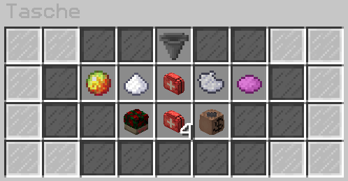

# Tasche 
Die Tasche kann mit dem Befehl **/inv** aufgerufen werden und somit den Tascheninhalt einsehen.  

## Taschenslots
Taschenslots sind die insgesamte Anzahl an Sachen, die bei sich in der Tasche getragen werden können. Der Tascheninhalt kann durch folgendes erhöht werden:

+ Durch das Leveln von [Skills](../../pages/skills/allgemein.md) erhältst du für jedes Level eines beliebigen Skills einen Taschenslot dazu.
+ Durch das Erwerben im [Shop von GermanRP](https://germanrpofficial.tebex.io)
  
## Aussehen
Nach dem Befehl **/inv** öffnet sich ein Menü, was wie folgt aussieht:

Durch das drüber halten des Mauszeigers lassen sich mehr Informationen darstellen. Ganz oben beim Trichter kann eingesehen werden, wieviel bereits belegt ist und wieviel Tascheninhalt man ingesamt hat.
Darunter befinden sich alle Sachen, welche man konsumieren kann oder bei sich führt.

### Inhalt

* [Heilkraut](../../pages/bmt/heilkraut.md)
* [Novapulver](../../pages/bmt/novapulver.md)
* [Medikamente](../../pages/bmt/medikamente.md)
    * Grippostat
    * Parcetamol
    * Betablocker
    * Nasensalbe
    * Antibiotika
* [Tablettenschachteln](../../pages/bmt/tablettenschachtel.md)
* [Mohnkapseln](../../pages/bmt/mohnkapseln.md)
* Mohnsamen
* [Schmerzmittel](../../pages/bmt/schmerzmittel.md)
* Schwarzgeld
