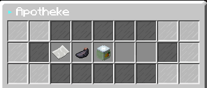
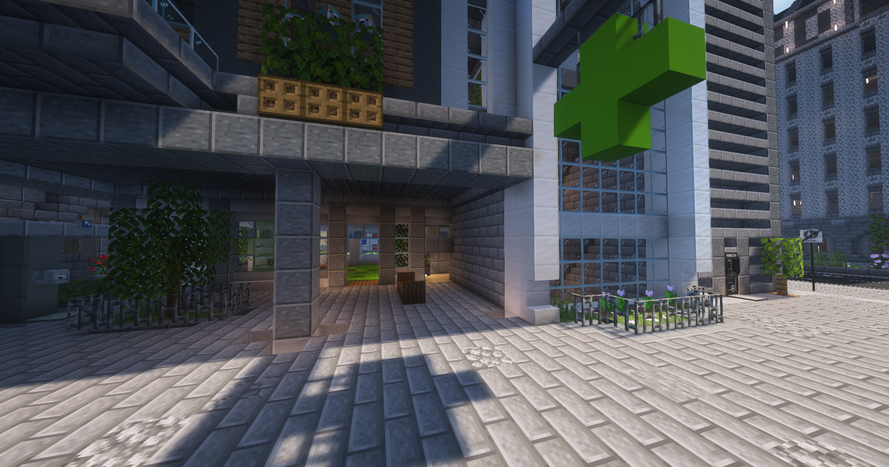

# Apotheke 
In der Apotheke findest du alles für deine Gesundheit. Ebenfalls können hier Rezepte gegen Medikamente eingetauscht werden.

## Sortiment 
In der Apotheke werden folgende Artikel verkauft: Bandagen, Nasensalbe & Hustenbonbons. 

* Bandage: Zur Regeneration der Herzen.
* Nasensalbe: Bei Nasenbluten.
* Hustenbonbons:  Bei Husten.

## Lage der Apotheken 
| Name | Ort | Nächste [Bushaltestelle] |
|:-:|:-:|:-:|
| Apotheke-1 | Downtown | Postzentrale |
| Apotheke-2 | Ganggebiet | Ganggebiet |
| Apotheke-3 | Reichenviertel | Reichenviertel |
| Apotheke-4 | Asia-Viertel | Asia-Viertel |
| Apotheke-5 | Westside | Westside |
