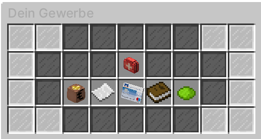
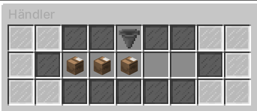

# Gewerbe

Jedes Gewerbe gehört einer Person oder dem [Gewerbemanagement](biz-managment.md). Der Lagervorrat ist nicht unendlich groß und muss regelmäßig von den Besitzern mit Lagerkisten aufgefüllt werden. Ist der Lagervorrat leer, kann dennoch die Ware gekauft werden, allerdings erhält der Gewerbebesitzer kein Geld mehr dafür.  Die Preise jedes einzelnen Gewerbes können vom jeweiligen BIZ-Besitzer geändert werden.
Jeder Gewerbebesitzer kann Mitarbeiter über das BIZ-Menü einstellen. 

### Auffüllen des Gewerbe-Lagers 

Um ein Lager aufzufüllen müssen die Besitzer oder Mitarbeiter eines Gewerbes zu den Händlern, welche in ganz Vance City verteilt stehen.
Jeder Händler hat verschiedene Lagerkisten im Angebot. 

!!! info "Preise der Lagerkisten"
    Die Preise der Lagerkisten können variieren. 
    Sie generieren sich alle 45 Minuten neu.

### Standorte der Händler

| Angebote | Nächste Bushaltestelle | Position |
|:-:|:-:|:-:|
| Apfel, Kaffee, Kakao, Sandwich, Wasser | Postzentrale | Lagerhalle Nord |
| Sprit | Uniklinik | Raffinerie |
| Kleinkalibrige Munition, Normale Munition | Justizvollzugsanstalt | Lagerhalle West |
| Bandage, Nasensalbe, Hustenbonbon | Gangviertel | Labor |
| Limonade, Cola | Plaza | Agavenhaus |
| Schweinefleisch, Rindfleisch, Hähnchenfleisch | Asia-Viertel | Asia-Markt |
| Muffin, Donut mit Zuckerguss, Pinker Donut, Schokodonut | Reichenviertel | Bäckerei |
