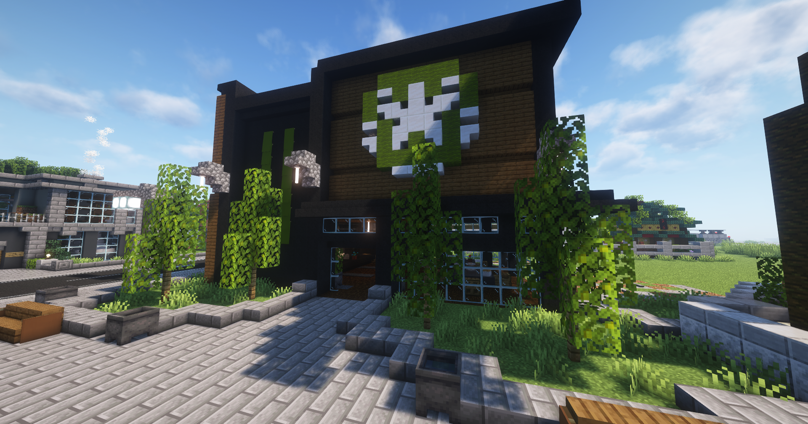

Bei Starblocks können Süßwaren und heiße Getränke gekauft werden. (**/navi Starblocks-1/2/3/4/5**)  

Bei Starblocks werden folgende Artikel verkauft: 

+ Kaffee
+ Kakao
+ Donut (Schokolade)       
+ Donut (Pink)
+ Donut (Zuckerguss)
+ Muffin  

### Standorte der Starblocks  

| Starblocks | Ort | Nächste [Bushaltestelle](../../pages/öpnv/bus.md) |
|:-:|:-:|:-:|   
| Starblocks-1 | [Rathaus](../../pages/orte/rathaus.md) | Postzentrale |
| Starblocks-2 | [Strandpassage](../../pages/gebiete/strandpassage.md) | Strandpassage |
| Starblocks-3 | [County](../../pages/gebiete/county.md) | County |
| Starblocks-4 | Mall | Uniklinik |
| Starblocks-5 | [Altstadt](../../pages/gebiete/altstadt.md) | Altstadt |
