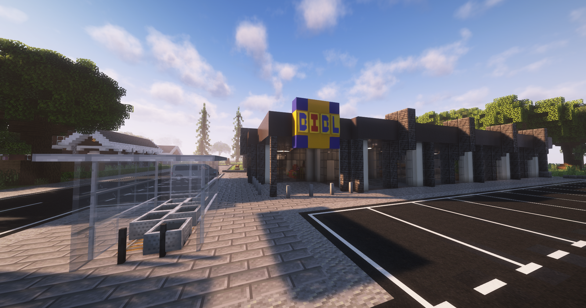

In Supermärkten können Lebensmittel gekauft werden. Leere Flaschen können an den Pfandflaschenautomaten entsorgt werden. (**/navi Supermarkt-1/2/3/4/5/6/7**)

Im Supermarkt werden folgende Artikel verkauft:  

+ Apfel
+ Schweinefleisch (Roh)
+ Rindgfleisch (Roh)
+ Hähnchenfleisch (Roh)
+ Wasser

!!! info "Essen zubereiten" 
        Das Fleisch muss vor dem Verzehr in einem Ofen eines [Hauses](../../pages/houses/allgemein.md) zubereitet werden.
  

### Standorte der Supermärkte 

| Supermarkt | Ort | Nächste [Bushaltestelle] |
|:-:|:-:|:-:|
| Supermarkt-1 | [Oststadt](../../pages/gebiete/oststadt.md) | Oststadt |
| Supermarkt-2 | [Reichenviertel](../../pages/gebiete/reichenviertel,md) | Reichenviertel |
| Supermarkt-3 | [County](../../pages/gebiete/county.md) | Plaza |
| Supermarkt-4 | [Downtown](../../pages/gebiete/downtown.md) | Polizeipräsidium |
| Supermarkt-5 | [Ganggebiet](../../pages/gebiete/ganggebiet.md) | Gangviertel (Nord) |
| Supermarkt-6 | [Asia-Viertel](../../pages/gebiete/asiaviertel.md) | Asia-Viertel |
| Supermarkt-7 | [Westside](../../pages/gebiete/westside.md) | Westside |

