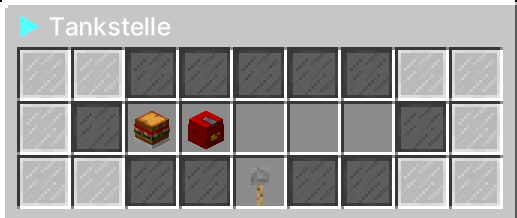
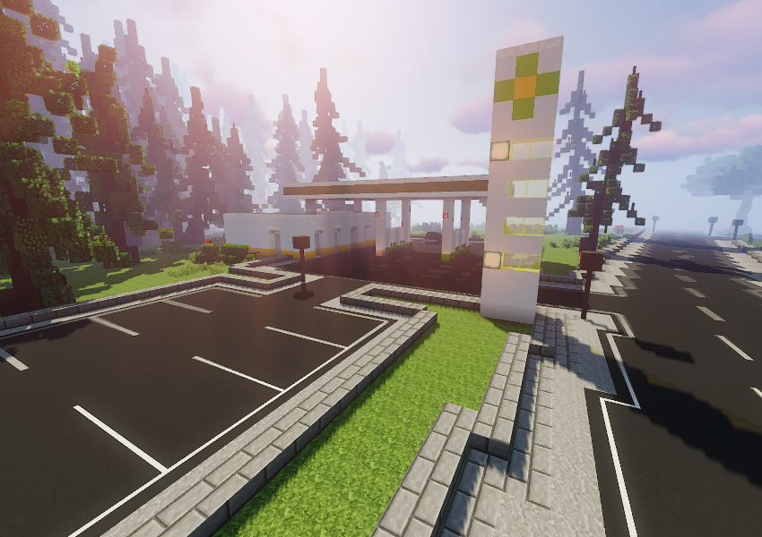

An Tankstellen können [Fahrzeuge](../../pages/fahrzeuge/allgemein.md) betankt werden.  Außerdem können an Tankstellen Sandwiches und Benzinkanister gekauft werden.
Um ein Fahrzeug tanken zu können, muss das Fahrzeug in der Nähe der richtigen Zapfsäule stehen. Mit einem **Rechtsklick** auf die Zapfsäule wird das Fahrzeug schrittweise betankt.
Nach dem Bezahlen ist der Tank im Fahrzeug gefüllt. (**/navi Tankstelle-1/2/3/4/5/6**)

### Standorte der Tankstellen  

| Tankstelle | Ort | Nächste [Bushaltestelle](../../pages/öpnv/bus.md) |
|:-:|:-:|:-:|
| Tankstelle-1 | [Downtown](../../pages/gebiete/downtown.md) | Uniklinik |
| Tankstelle-2 | [County](../../pages/gebiete/county.md) | Plaza |
| Tankstelle-3 | [Altstadt](../../pages/gebiete/altstadt.md) | Altstadt |
| Tankstelle-4 | [Asia-Viertel](../../pages/gebiete/asiaviertel.md) | Asia-Viertel |
| Tankstelle-5 | [Westside](../../pages/gebiete/westside.md) | Westside |
| Tankstelle-6 | Autobahn | [Farm](../../pages/gebiete/oststadt.md) | 
| Tankstelle-7 | [Reichenviertel](../../pages/gebiete/reichenviertel.md) | Reichenviertel |
