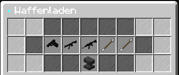
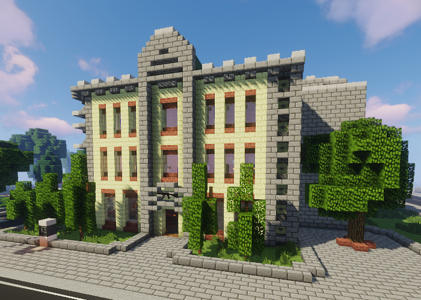

# Waffenladen
In einem Waffenladen lassen sich Waffen und Munition für Selbstverteidigung kaufen. Hier kannst du auch an deine Waffen ein Waffenaddon anbringen. (**/navi Waffenladen-1/2/3/4**) 

In Waffenladen werden folgende Artikel Verkauft:  

+ [P-51](../../pages/items/weapons/pistole.md) (Handschusswaffe)
+ [MX8](../../pages/items/weapons/maschinenpistole.md) (Maschinenpistole)
+ [Havok-47](../../pages/items/weapons/sturmgewehre.md) (Sturmgewehr)
+ Normale Munition
+ Kleine Munition

!!! info "Waffenaddon anbringen"

    Waffenaddons können mit der Waffe kombiniert werden in dem man auf den Amboss im NPC-Menü drückt und Waffe + Addon kombiniert

## Standorte der Waffenläden 

| Name | Stadtteil | Nächste Bushaltestelle |
|:-:|:-:|:-:|
| Waffenladen-1 | Oststadt | Oststadt |
| Waffenladen-2 | County | County |
| Waffenladen-3 | Ganggebiet | Gangviertel (Nord) |
| Waffenladen-4 | Asia-Viertel | Asia-Viertel |

