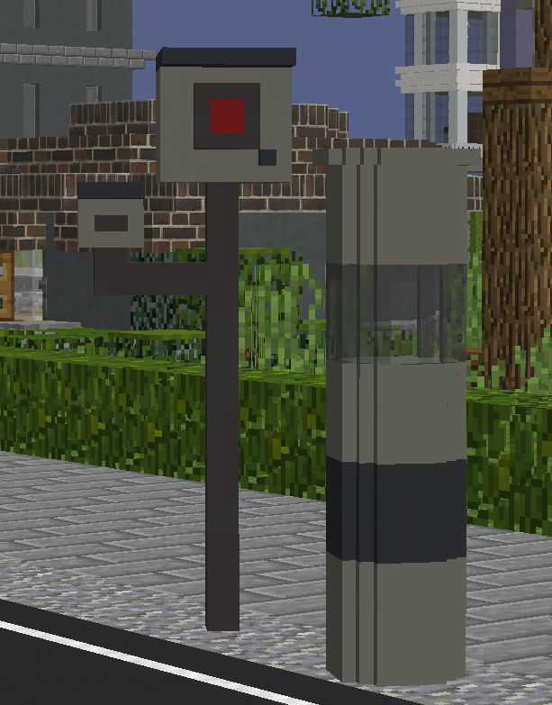
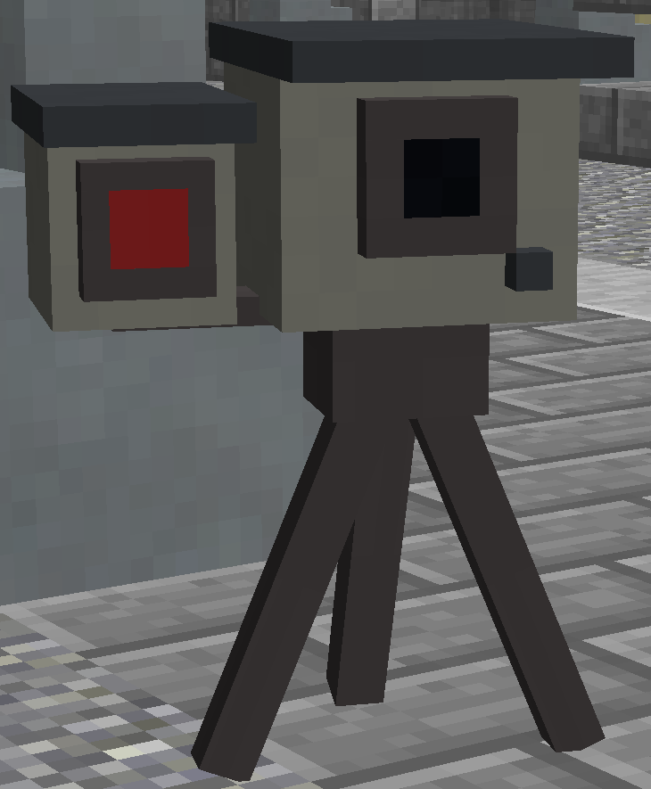
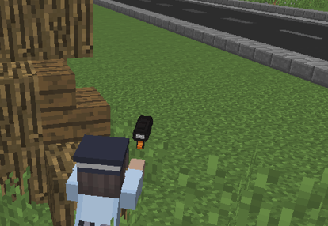

## Blitzer

Die Blitzer sind in ganz Vance City verteilt, um Geschwindigkeitsüberschreitungen zu erfassen. 
Das errechnete Bußgeld hängt von der überschrittenen Geschwindigkeit ab.

Man kann mit einer Brechstange einen Blitzer zerstören, wodurch er vorübergehend außer Betrieb ist.

### Mobile Blitzer 

Die Polizei verfügt über mobile Blitzer, die sie überall in Vance City aufstellen kann. Erkennbar sind sie an den kleinen Blitzern und dem Van, der daneben steht.

### Radarpistolen

Ebenfalls besitzt der Staat Radarpistolen, die das gleiche Ziel wie Blitzer verfolgen. Radarpistolen funktionieren wie mobile Blitzer, die der Staat in der Hand hält, um Fahrzeuge zu blitzen, die zu schnell sind. 

## Blitzer-Bußgeld

| Geschwindigkeitsüberschreitung | Bußgeld | [Fahndungspunkte](../../pages/allgemein/fahndungspunkte.md) |
|:-:|:-:|:-:|
| 3–10 km/h | 25 € | Nein |
| 11–15 km/h | 50 € | Nein |  
| 16–20 km/h | 75 € | Nein |
| >21 km/h | 100 € | Ja |

Wird man ohne Führerschein geblitzt, erhält man Fahndungspunkte für **Fahren ohne Führerschein**.
