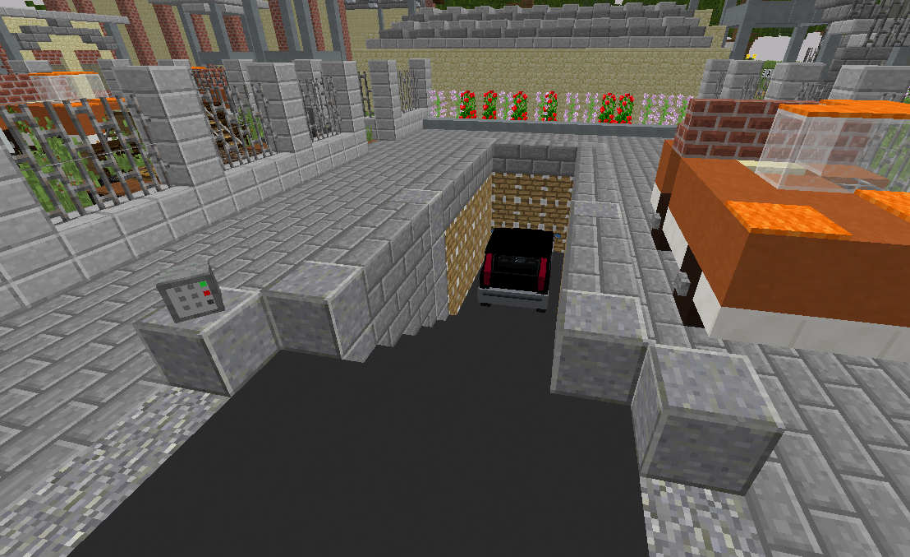

Die Schrotpresse dient dazu Fahrzeuge, welche man nicht mehr  braucht oder auch aus Geldproblemen zerschrotten muss. 
Zerschrottet man ein Fahrzeug bekommt Geld wieder. Der Preis ist davon abhängig, wieviele Kilometer das Fahrzeug hat. Nur der Besitzer des Fahrzeug ist berechtigt das Fahrzeug zu schrotten.
(**/navi Schrottpresse**)

### Zerschrotten
Ein Auto kann verschrottet werden, sobald das eigene Fahrzeug in der Schrottpresse steht. 
Nach drücken des Kopfes vor der Presse wird das Fahrzeug verschrottet.
