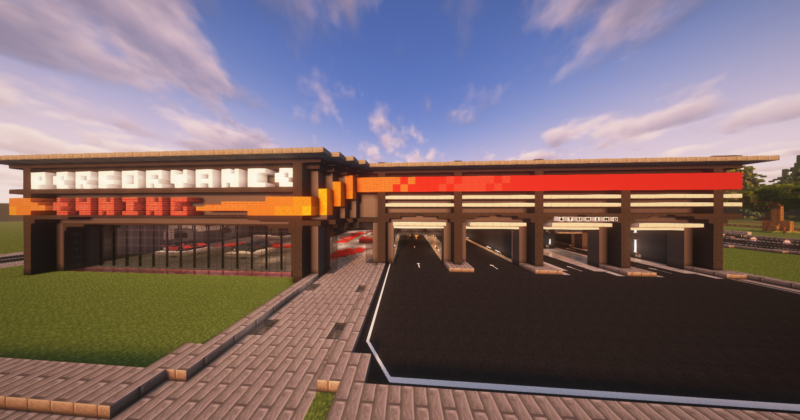

## Tuningsystem

Die Tuningwerkstatt ist in Westside auffindbar und erreichbar über **/navi Tuning**.

| Erweiterung | Details | Level |
|:-:|:-:|:-:|
| Motor-Tuning Stage 1 | Erhöht die Höchstgeschwindigkeit um 5 km/h | – |
| Motor-Tuning Stage 2 | Erhöht die Höchstgeschwindigkeit um weitere 5 km/h | 60 |
| Getriebeoptimierung | Verbessert die Beschleunigung um 1,5 × | – |
| Sportbremsen | Verbessert den Bremsweg um 1,5× | – |
| Airbag | 3x nutzbar, verhindert Beinbrüche oder Verstauchungen | – |
| E‑Call‑System | Ruft bei Bewusstlosigkeit nach einem Unfall automatisch den Notruf | – |