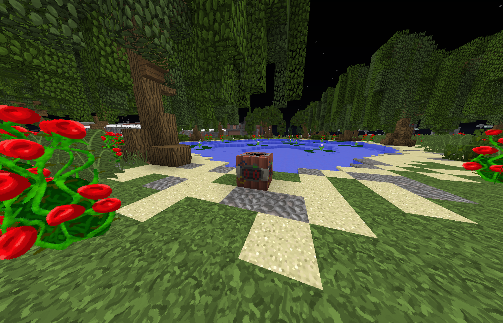

# Bomben

Die Bomben sind Fraktionsaktivitäten der Fraktionen [Medellin Kartell](../../pages/fraktionen/kartell.md) und [Sinaloa Kartell](../../pages/fraktionen/cds.md). Diese Aktivitäten gibt den Fraktionen finanzielle Einnahmen. Die Bombe kann alle 6 Stunden gelegt werden und muss von den Kartell-Membern hergestellt werden.

## Herstellung
Member der Kartelle können mit folgenden Materialien im Labor eine Bombe herstellen:

- 3x Blankopapier
- 12x Schwarzpulver

**Blankopapier**

Man erhält 1 Blankopapier, wenn man 32 entrindete Holzstämme zur Papierfabrik bringt. Dort angekommen kann man mit einem Rechtsklick auf dem gezeigten Trichter die Herstellung des Papiers starten.

**Schwarzpulver**

Schwarzpulver kann man im Bergwerk (/navi Bergwerk) abbauen. Die Pulverspitzhacke zum Abbauen erwirbt man beim NPC Aufseher. Mit der Pulverspitzhacke in der Hand, kann man vereinzelt die Schwarzpulver Vorkommen abbauen, welche einem Schwarzpulver geben.

## Ablauf
1. Die Mitglieder des Kartells stellen eine Bombe her und bringen diese an einen wirtschaftlich relevanten Ort.
2. Nun wird die Bombe, mit /bombe, platziert. Dabei müssen einige [Regeln](https://germanrp.eu/forum/index.php?thread/1-regelwerk/) beachtet werden.
3. Sobald die Bombe platziert wurde, geht ein Alarm los, welcher für jede Person auf dem Server zu sehen ist.
4. Die [Polizei](polizei.md) rückt inzwischen an und versucht die Bombenleger zu neutralisieren. Sie haben dabei 10–12 Minuten Zeit, bis die Bombe explodiert.
5. Konnten die Bombenleger erfolgreich neutralisiert werden, erhält die Polizei einen Zettel, auf dem der richtige Bombendraht angegeben wird.
6. Schafft es die [Polizei](polizei.md) nicht rechtzeitig, die Bombenleger zu neutralisieren, explodiert die Bombe und alle Personen im näheren Umkreis werden getötet und können nicht wiederbelebt werden.

## Bombendraht
Eine Bombe besteht aus drei Drähten. Einem roten, grünen und blauen Draht. Die [Polizei](polizei.md) hat zwei Möglichkeiten:

- Sie bringen den Bombenleger zur Strecke und erhalten einen Hinweis auf den richtigen Draht.
- Sie versuchen, zu raten, welches der richtige Draht ist. (Diese Option dürfen sie nach 10 Minuten wählen)

Wurde der richtige Draht gewählt, gewinnt der Staat.
Wird der falsche Draht gewählt oder die Zeit ist abgelaufen, gewinnt das Kartell.  In diesem Falle erhält das Kartell Geld, der Fraktionskasse von den Polizisten in die eigene Fraktionskasse.

