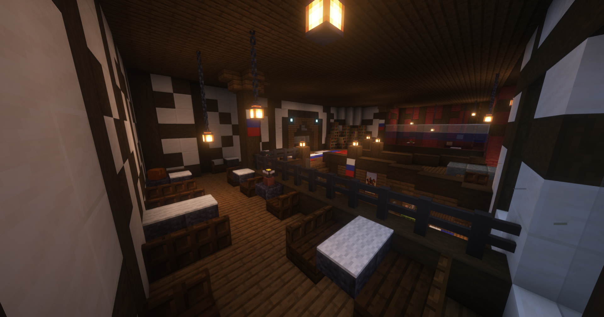

# Bratva-Gang

Vor Kurzem hat die Bratva-Gang eine bedeutende Veränderung an ihrer Spitze erlebt. Ein neuer Wind weht durch die Reihen.
Seit M. Ivanov zusammen mit seiner Tochter Chara das Kommando übernommen hat, hat sich der Ton in der Straßengang spürbar verändert. Mit einer Mischung aus Charisma, Berechnung und Furchtlosigkeit haben Sie sich in kürzester Zeit an die Spitze gesetzt und niemand wagt, Ihre Entscheidungen in Frage zu stellen.

## Hintergrundgeschichte 
In den öl- und blutgetränkten Gassen einer alten Hafenstadt im Norden Russlands entstand die Bratva-Gang, die sich von skrupellosen Arbeitern zur gefürchtetsten Straßengang VanceCitys entwickelte. Geprägt von roher Gewalt, Angst und absoluter Loyalität kontrollierten sie Schutzgelder, Schmuggel und das Verschwinden von Gegnern, gestützt durch Spione, Behördenkontakte und Unterstützer. Nach den Gründern übernahm ihr Enkel die Führung, während seine Tochter den Kern der Gang leitet: die Bar „mesto wstretschi“, deren Rauch und Alkoholgeruch den Marktplatz erfüllen.

## Auftreten 

Nach außen tritt die Bratva-Gang offen als gefährliche Straßengang auf. Ihre Präsenz ist in Vance City allgegenwärtig. Sie sind laut, unberechenbar und furchteinflößend. Chaos, Gewalt und Einschüchterung sind ihre Werkzeuge, mit denen sie ihr Territorium sichern und ihren Einfluss stetig ausweiten.

## Aktivitäten
Die Fraktion geht folgenden Aktivitäten nach:

* Herstellung und Verkauf von illegalen Betäubungsmitteln
* [Apothekenraub](apothekenraub.md)
* Bearbeitung von [Darklists](darklist.md)
* Bearbeitung von [Kopfgeldern](kopfgeld.md)
* [Hackangriffe](hackangriff.md)
* [Substanzendealer](substanzendealer.md) abfangen

## Lage des Hauptquartiers

Die Bratva-Familie hat sich mitten im Herzen der Altstadt niedergelassen. Direkt in einer alten, besetzten Boulangerie direkt am belebten Marktplatz.
