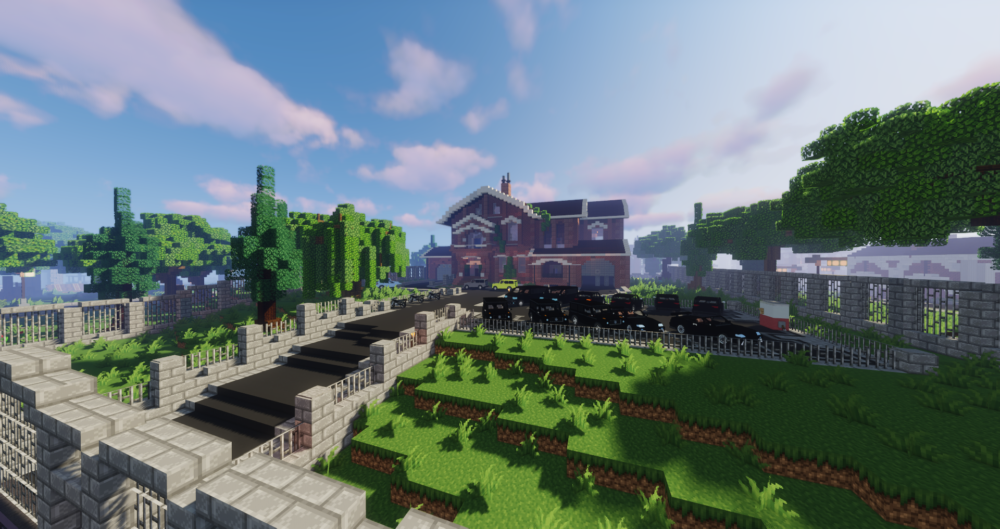

# Camorra
Die Camorra ist eine italienische Mafia, welche unter einem pharmazeutischen Deckgeschäft agieren. Ihre Geheimhaltung der Indentät ist oberstes Gut und nutzen jedes Mittel zur Verschleierung. Sie tragen Maskierungen und verfälschen Personalausweise und [Lizenzen](../../Pages/allgemein/lizenzen.md), damit ihnen die Polizei oder Rivalen nicht auf die Fährte kommen und sind Meister der Intrigenspiele, Manipulationen und Bestechungen.

## Hintergrundgeschichte 

## Auftreten 

Nicht italienische Mitglieder werden angehalten italienische Worte zu übernehmen, um besser mit ihrer Familie kommunizieren zu können. Mitarbeiter des Betriebes verhalten sich in der Öffentlichkeit seriös. Ihre Arbeitskleidung besteht aus einem Anzug oder dezenten Kleidern und farblich schwarz-weiß gehalten. Bei kriminellen Aktivitäten treten sie maskiert auf um ihre Indentität zu schützen.

## Aktivitäten
Die Fraktion geht folgenden Aktivitäten nach:

* Herstellung und Verkauf von illegalen Betäubungsmitteln
* Apothekenräuben
* Bearbeitung von Darklists
* Bearbeitung von Kopfgeldern
* Juwelenräuben
* Mohnfelder abbauen

## Lage des Hauptquartiers

Die Camorra hat ihren Standort im Reichenviertel als ihre pharmazeutische Firma "Il Fiore Scuro".
 

