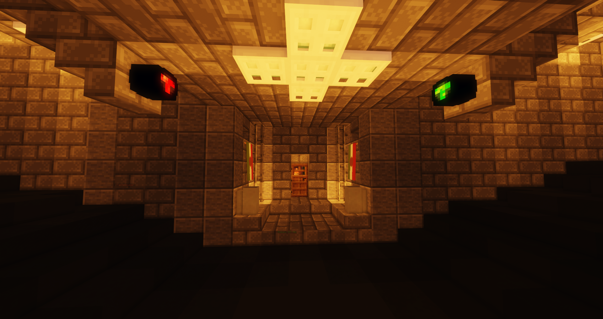

!!! info "Status"
    Die Fraktion Sinaloa Kartell ist zur Zeit deaktiviert und gilt als Leerfraktion.
    Besteht ein Interesse, kann sich im [Forum](https://germanrp.eu/forum/index.php?thread/10212-vorlage-leerfraktion-übernehmen/) an das Fraktionsmanagement gewendet werden.

# Sinaloa Kartell
Das Sinaloa Kartell ist ein mexikanisches Kartell. Seit Jahren machen sie  das Medellín Kartell verantwortlich, dass ihr Anführer bei Vermittlungsgesprächen zwischen den Kartellen von der Regierung verhaftet und ausgeliefert worden ist. In ihren Augen ist das kolumbianische Kartell ein Erzfeind und Veräter, welches sie mit allen Mitteln auslöschen möchten. Sie organisieren gezieltes Verbrechen und sind für viele Bombenanschläge verantwortlich.

## Hintergrundgeschichte 
Aktuell nicht verfügbar.

## Auftreten 
Mitglieder des Sinaloa Kartell sind leicht militärisch gekleidet. Sie sind erkennbar an ihren Camouflage Hosen und tragen an ihrer Kleidung die mexikanische Flagge.

## Aktivitäten
Die Fraktion geht folgenden Aktivitäten nach:

* Herstellung und Verkauf von illegalen Betäubungsmitteln
* Bombenangriffe
* Bearbeitung von Darklists
* Bearbeitung von Kopfgeldern

## Lage des Hauptquartiers
Sie arbeiten im Untergrund eines Tunnels zwischen dem [County](../../pages/gebiete/county.md) und [Asiaviertel](../../pages/gebiete/asiaviertel.md).
