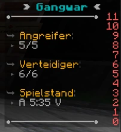
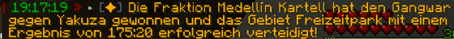

# Gangwar

Der Gangwar ist eine Handlung zwischen Crimefraktionen. Sie kämpfen um die verschiedenen Gangzonen, die es gibt, welche Vorteile für die besetzende Fraktion bringt. Alle drei Tage bekommt die Fraktion durch die Gangzone 1 Tabelettenschachtel

## Ablauf eines Gangwars
Eine Fraktion kann eine Kriegserklärung im Feedbeck Bereich der jeweiligen Fraktion im [Forum](https://germanrp.eu/forum/) stellen. Sie muss drei Terminvorschläge stellen. Die verteidigende Fraktion hat nun 24 Stunden Zeit auf diese Ankündigung zu antworten oder drei Gegenvorschläge mit anderen Terminen anzubringen. Ansonsten geht die Gangzone kampflos an die angreifende Fraktion. Konnte sich auf ein Termin geeinigt werden, haben die beiden Fraktionen Zeit sich auf den Gangwar vorzubereiten. Ist der Tag und die Uhrzeit gekommen, greift der Leader, der angreifenden Fraktion, mit einem Befehl das Gebiet an. Der Start des Gangwars wird allen Spielern auf den Server angekündigt und die Infotafel ändert sich zu einem Scoreboard. Die verteidigende Fraktionen hat nun 60 Sekunden Zeit sich in der Gangzone aufzuteilen. Nach Ablauf der Zeit, greift die Fraktion an. Ziel ist es 150 Punkte zu bekommen. 
 Pro Kill bekommt man 5 Punkte. Die Verteidiger erhalten alle 5 Minuten fünf Punkte. Eine Runde dauert solange, bis alle Gegner einer Fraktion gestorben sind. Die Fraktion, die dann noch lebt, bekommt für den Rundensieg 15 Punkte. Alle Gangwarmitglieder können durch das Scoreboard mitverfolgen, wie der Punktestand ist. Der Gangwar dauert so lange an, bis eine Fraktion 150 Punkte erreicht hat. Nach Beendigung des Gangwars, wird eine globale Nachricht mit dem Ergebnis an die Spieler gesendet. Die Gangzone wird automatisch der siegreichen Fraktion überschrieben. Die Fraktionen haben jederzeit die Option auch den Gangwar aufzugeben.

 

##Gangzonen
| Zone | Gebiet | Besetzende Fraktion |
| :-: | :-: | :-: |
| Agavenfarm | County | [Camorra](,,/camorra.md) |
| Farm | Oststadt/Farm | [Camorra](,,/camorra.md) |
| Freizeitpark | Asiaviertel | [The Establishment](../establishment.md)  |
| Raffinerie | Downtown | [Medellín Kartell](../kartell,md) |
| Schmelzwerk | Ganggebiet | [Medellín Kartell](../kartell,md) |
| Yachthafen | Strandpassage | [The Establishment](,,/establishment.md) |

