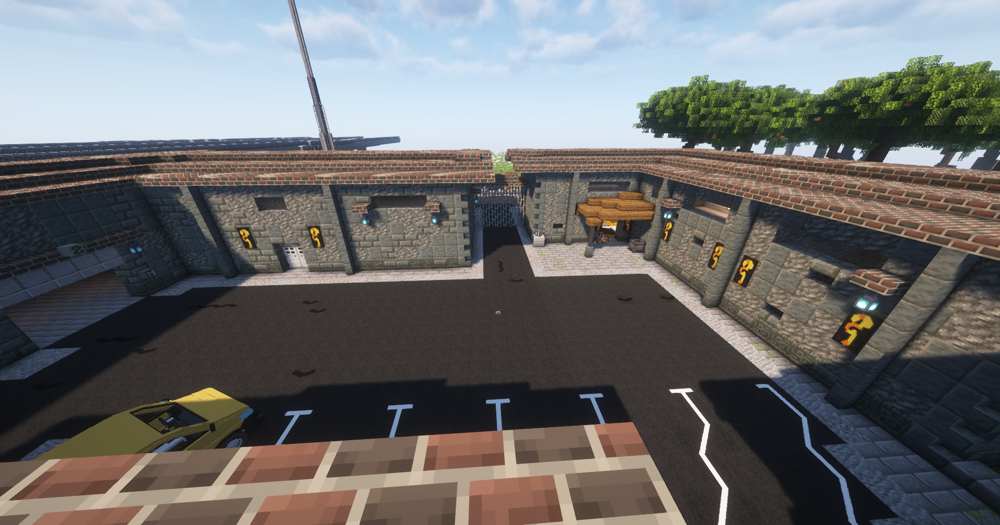

# Iron Serpents

Niemand weiß genau, wann sie auftauchten. Manche behaupten, sie seien Überreste einer alten East-Coast-Gang, die sich nach New Yorks Straßenkriegen neu formierte. Andere sagen, sie seien wie ein Sturm über die Stadt gekommen — lautlos, gefährlich, berechnend.
Man mischt sich nicht in ihre Wege ein … nicht, wenn man den morgigen Tag erleben möchte. Loyalität ist das Fundament ihrer Existenz. Verrat wird nicht besprochen — er wird beseitigt.

## Serpent Customs

Eine scheinbar harmlose Autowerkstatt im Gewerbegebiet Norden.
Nach außen: Reparaturen, Tuning, Lackierung.
Nach innen: Geldwäsche, Treffen, Lagerraum und Versteck für Ware.

## Hintergrundgeschichte 
Die Wurzeln der Iron Serpents liegen an der amerikanischen Ostküste. Ursprünglich als kleine, aber gefürchtete Streetgang in den Blocks von New York aktiv, entwickelte sich aus ihr eine organisierte, effiziente Fraktion, nachdem mehrere kleinere Crews unter einer Führung zusammengeschweißt wurden. Mitglieder stammen aus verschiedenen Vierteln, Kulturen und Hintergründen, vereint durch Respekt, Loyalität und die Bereitschaft, Risiken einzugehen, die andere niemals tragen würden.

## Auftreten 

Ihre Mitglieder tragen dunkle Streetwear, kombiniert mit goldenen Details, die im Licht flackern wie Schuppen eines Ungetüms. Die Iron Serpents sind kein chaotischer Haufen von Schlägern. Sie sind organisiert, strukturiert und folgen ungeschriebenen Regeln, die härter sind als Stahl. Die Serpents arbeiten nicht chaotisch. Jeder weiß, wo sein Platz ist — und welchen Preis es kostet, ihn zu verlieren.

## Aktivitäten
Die Fraktion geht folgenden Aktivitäten nach:

* Herstellung und Verkauf von illegalen Betäubungsmitteln
* [Apothekenraub](apothekenraub.md)
* Bearbeitung von [Darklists](darklist.md)
* Bearbeitung von [Kopfgeldern](kopfgeld.md)
* [Hackangriffe](hackangriff.md)
* [Substanzendealer](substanzendealer.md) abfangen

## Lage des Hauptquartiers

Die Iron Serpents hat sich hinter den Lagerhallen im Auheim niedergelassen.