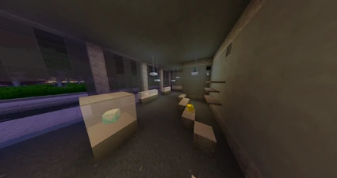

# Juwelenraub

Der Juwelenraub ist eine Fraktionsaktivität der Fraktion [Yakuza](yakuza.md), der [Camorra](camorra.md) und des [Establishments](establishment.md). Diese Aktivität gibt der Fraktion finanzielle Einnahmen und [Combat-XP](../../pages/skills/combat.md). Der Juwelenraub kann beliebig oft gestartet werden.

## Ablauf
1. Die Mitglieder der Crimefraktion versammeln sich beim Juwelier.
2. Ein Mitglied gibt den Befehl **/juwelenraub** ein.
3. Nun haben sie drei Minuten Zeit die Steinblöcke unter den Glasblöcken (Vitrine) abzubauen.
4. Jeder Block kann nur einmal abgebaut werden und generiert Geld und Combat-XP.
5. Nach drei Minuten wird der Gesamterlös im Chat angezeigt und der Raub ist beendet.
6. Nach dem Start muss die Fraktion noch 10 Minuten sich in [Downton](../../pages/gebiete/downtown.md) verstecken. Nach den 10 Minuten dürfen sie Downtown verlassen.

## Der Sicherheitsalarm
Bei jedem Block der abgebaut wird, besteht das Risiko, dass ein stiller bei der [Polizei](polizei.md) eingeht. [Polizei](polizei.md) und [Rettungsdienst](rettungsdienst.md) kriegen dann eine Meldung im Chat. Die Crimefraktionen kriegen davon allerdings nichts mit. Sie müssen also selber abschätzen, ob sie noch einen Block abbauen oder mit der bereits gesammelten Beute das Weite suchen.

Werden sie von der [Polizei](polizei.md) erwischt, erhalten die Mitglieder der Crimefraktion [Fahndungspunkte](../../pages/allgemein/fahndungspunkte.md).

