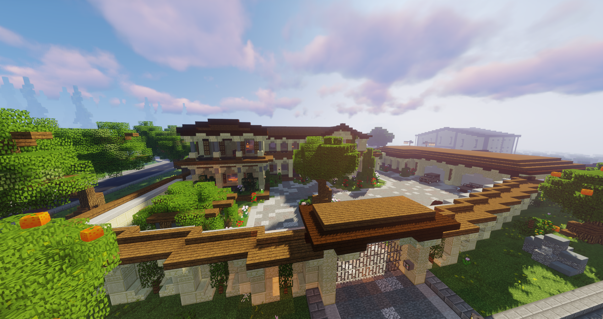

# Medellín Kartell
!!! info "Status"
    Die Fraktion Medellín Kartell ist derzeit deaktiviert und gilt als Leerfraktion.   Bei Interesse kann im **[Forum](https://germanrp.eu/forum/index.php?board/188-fraktion-vorschlagen/)** ein Antrag an das Fraktionsmanagement gestellt werden.
    

Das Medellín Kartell ist ein kolumbianisches Kartell, welche unter einem verdeckten Agaven-Verarbeitungsgeschäft agieren. Ihre Geheimhaltung der Identität ist die oberste Priorität und nutzen jedes Mittel zur Geheimhaltung des Geschäftes. Sie planen große Bombenanschläge gegen den [Staat](allgemein.md) und überfallen [Apotheken](../../pages/biz/apotheke.md), damit sie der größte Export von [Novapulver](../../pages/bmt/novapulver.md) sind.

## Hintergrundgeschichte 
Das Medellín-Kartell war Anfang der 1980er bis Mitte der 1990er Jahre der größte Agaven-Exporteur weltweit.
Es konzentrierte seine Aktivitäten von der kolumbianischen Stadt Medellín bis zu den Absatzmärkten in den USA, mit dem Schwerpunkt in Miami und Florida.
Die Entstehung des Kartells, das eher den Charakter einzelner, nebeneinander agierender Unternehmen als den einer straff geführten, kriminellen Organisation, war eng mit der rasant steigenden Nachfrage nach Agaven in den USA Ende der 1970er verbunden.

## Auftreten 
Das kolumbianische Kartell trifft bei anderen Leuten eher neutral und freundlich rüber. Die Mitglieder des Kartells erkennt man durch ihre gebräunte Haut und dem starken spanischen Akzent. An ihrer Kleidung sind stets kolumbianische Flaggen zu sehen. Sie arbeiten und handeln verdeckt durch eine Agaventee-Bar.

## Aktivitäten
Die Fraktion geht folgenden Aktivitäten nach:

* Herstellung und Verkauf von illegalen Betäubungsmitteln
* [Bombenangriffen](bomben.md)
* [Apothekenräuben](apothekenraub.md)
* Bearbeitung von [Darklists](darklist.md)
* Bearbeitung von [Kopfgeldern](kopfgeld.md)

## Lage des Hauptquartiers
Das Medellín Kartell hat ihren Standort neben der Agavenfarm in [County](../../pages/gebiete/county.md). Zu Erreichen sind sie mit der [Bushaltestelle](../../pages/öpnv/bus.md) Plaza.
