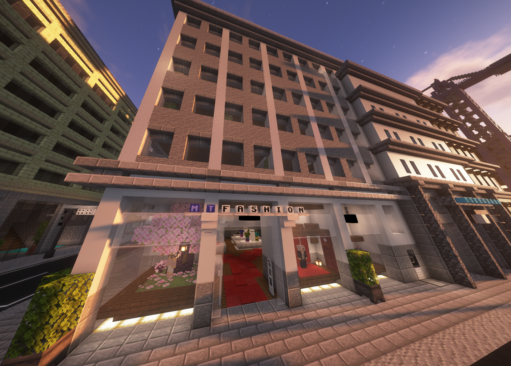

# MT-Fashion

!!! info "Seiteninfo" 
      Diese Seite befindet sich noch im Aufbau. Der Beitrag ist daher noch **nicht vollständig!**
      
MT-Fashion agiert als Textildienstleister für die Spieler und sorgt dafür, dass sie stets modisch gekleidet sind. 
Durch die Beratung der Fraktionsmitglieder bleiben die Spieler im Trend, während gleichzeitig die individuellen Wünsche des Klientels berücksichtigt werden.

## Aufgaben

Die MT-Fashion versorgt Klientel mit modischer Kleidung. Dabei hat die Presseagentur verschiedene Aufgabenbereiche:

* XXX
* XXX
* XXX
* XXX
* XXX

## MT-Fashion-Equip

Die MT-Fashion verfügt über kein Equip

## Lage der MT-Fashion

Zum MT-Fashion gelangt man, indem man den Bus zum Altersheim verwendet. In der Nähe befindet sich die [Wäscherei](../../pages/nebenjobs/wäscherei.md)
