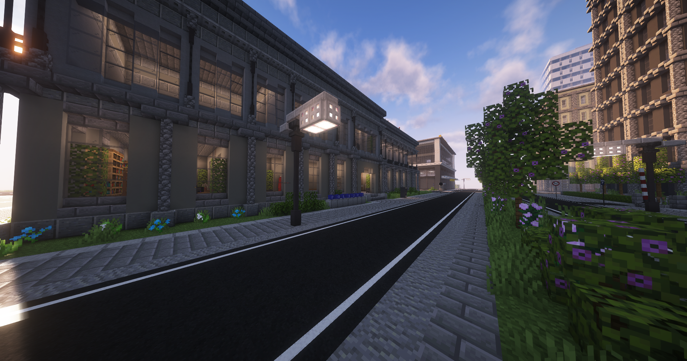

# Polizei

 !!! info "Seiteninfo"
     Diese Seite befindet sich noch im Aufbau. Der Beitrag ist daher noch **nicht vollständig!**

Die Polizei sorgt für die Sicherheit aller Spieler auf dem Server. Sie gehen Notrufen nach, suchen Verbrecher und sind täglich in große Schießerein verwickelt. Neben der Polizei gibt es das Sondereinsatzkommando (SEK), welche andere Polizeiausstattung hat, als die Polizei und unterstützen diese in Schießerein.
Die Kriminalpolizei (Kripo) ist für die Ermittlung von Straftaten zuständig. Sie untersuchen gelöschte Gewerbe, verhören Personen und nehmen Anzeigen auf.

## Aufgaben

Die Polizei sorgt für Recht und Ordnung in jedem Teil der Stadt Vance City. Dabei hat die Polizei verschiedene Aufgabenbereiche:

* [Fahndungspunkte](../../pages/allgemein/fahndungspunkte.md) (WPS) vergeben
* Verbrecher jagen und verhaften
* Illegale Betäubungsmittel finden und vernichten
* an öffentlichen Orten Präsenz zeigen
* [Apothekenraub](apothekenraub.md), [Juwelenraub](juwelenraub.md) und [Bomben](bomben.md) verhindern
* [Notrufe](../../pages/allgemein/notrufe.md) bearbeiten
* Für das Wohl jedes Einzelnen Spielers sorgen
* Gebrauch von exklusiver Polizeiausstattung
* Staatsmeldungen ausrufen
* Spieler in der [JVA](../../pages/orte/jva.md) kontrollieren

## Polizeiequip

| Equipment | Funktion | Subfraktion |
|:-:|:-:|:-:|
| Handschellen | Verdächtige Personen fixieren | Alle |
| Fallschirm | Möglichkeit taktische Orte aufzusuchen | SEK |
| Tazer | Verdächtige Personen niederstrecken | Alle |
| Schild | Abwehren von Schüssen | Alle (R10+) |
| Rammbock | Aufbrechen von Türen | Alle |
| Blendgranate | Gibt Personen im Umkreis der Explosion einen Blindheitseffekt | SEK |
| [RTB-X](../../pages/items/weapons/sniper.md) | Fernkampf | SEK |

## Lage der Polizeistationen

Zu der Polizeistation gelangt man, indem man den Bus zur Polizeipräsidium verwendet. Zudem gibt es auf der Karte verteilt zwei weitere Nebenstellen der Polizei. Im Reichenviertel ist das Polizeirevier-Süd aufzufinden, dessen [Bushaltestation](../../pages/öpnv/bus.md) "Reichenviertel" ist. Das Polizeirevier-West ist in Westside zu finden, hier auch mit der gleichnamigen Bushaltestelle.

## Abteilungen
Die Polizei besitzt 3 verschiedene Abteilungen. Als Mitglied der Polizei bist du in einer Abteilung.

### Streifendienst
Der Streifendienst ist die Abteilung wo man keine weitere Tests oder sonstiges ausführen muss. Im Streifendienst hast du verschiedene Aufgaben wie das herumfahren und nach Falschparkern schauen. Oder auch Bürger mit Fahndungspunkten zu verhaften. Das teilnehmen einer Fraktionsaktivität von den Crimefraktionen, gehören auch zu den Aufgaben dazu. Du bleibst im Streifendienst solange, du dich nicht für eine andere Abteilung entscheidest.

### SEK
Das SEK sorgt für eine reibungslose Schießerei wenn es zu einer kommt. Mit den verschiedenen Equipitems, können die sich die Arbeit für sich und für die anderen Polizisten Schießereien einfacher machen. Um in das SEK reinzukommen muss man verschiedene Tests durchführen um dich von der besten Seite zu zeigen. 

### Kriminalpolizei
Die Kriminalpolizei kümmert sich um Akten und finden und sprechen mit den Verbrechern. Dabei spezialisieren Sie sich sehr darauf die Verbrechern zu überführen. Um ein Mitglied der Kriminalpolizei zu werden, musst 
