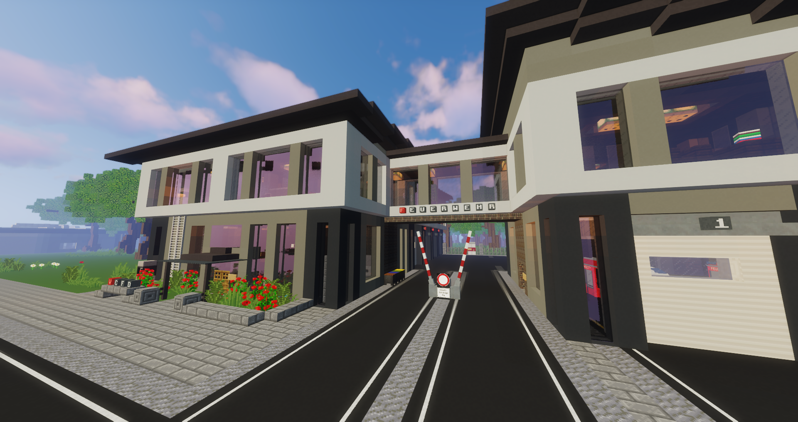

# Rettungsdienst
   
Der Rettungsdienst betreut und behandelt alle Spieler auf dem Server und trägt die Verantwortung für eine stabile medizinische Versorgung und ein funktionierendes Gesundheitssystem. Sie führen Behandlungen durch, stellen Diagnosen, verschreiben Rezepte und retten täglich bewusstlose Personen auf der Straße. 

## Aufgaben
Der Rettungsdienst verfügt über verschiedene Möglichkeiten, den Spielern auf dem Server zu helfen:

* Impfungen verabreichen  
* Verstauchungen und Brüche schienen  
* Röntgenuntersuchungen durchführen  
* Rezepte für verschiedene Krankheiten ausstellen  
* Bewusstlose Spieler wiederbeleben  
* Blutanalysen und Operationen durchführen  
* Auf Notrufe reagieren  

Die Subfraktion des Rettungsdienstes, die Feuerwehr, übernimmt zusätzlich folgende Aufgaben:  
* Türen öffnen  
* Feuer löschen  

## Rettungsdienst-Equip

| Equipment | Funktion |
|:-:|:-:|
| Schiene | Behandlung verstauchter/gebrochener Beine |
| Leere Spritze | Impfungen und Blutabnahmen |
| Feuerlöscher | Feuer löschen |
| Pfefferspray | Selbstschutz des Personals |
| NaCl | Behandlung der [Dehydration](../../pages/krankheiten/dehydration.md) |
| Sprungtuch | Platzieren von Slimeblöcken |
| Feuerwehraxt | Einsatzgerät für Türöffnungen |
| Insulin-Spritze | Hormon zur Regulierung des Blutzuckerspiegels |
| Glucose-Infusion | Energiequelle |

## Lage der medizinischen Gebäude 
<!--- Hier kommt ein Bild von Uniklinik --> 

Die Uniklinik ist der Hauptstandort des Rettungsdienstes und ist über die Bushaltestelle "Uniklinik" erreichbar. Das mit Ziegelsteinen gebaute Gebäude liegt in der Nähe des Busses und direkt am Park. 
  

Der Rettungsdienst hat weitere Gebäude auf der Karte verteilt. Die Feuerwehrwache befindet sich ein paar Straßen weiter in Downtown. Ebenfalls ist der Rettungsdienst in [Oststadt](../../pages/gebiete/oststadt.md) mit einer Rettungswache ausgerüstet.
Auf der Karte gibt es zwei weitere Krankenhäuser. Das Krankenhaus-Süd befindet sich im [Reichenviertel](../../pages/gebiete/reichenviertel.md), ist mit dem Bus "Reichenviertel" erreichbar und liegt in unmittelbarer Nähe zur Polizeistation-Süd. In [Westside](../../pages/gebiete/westside.md) befindet sich das zweite Krankenhaus "Krankenhaus-West", das mit der Bushaltestelle "Westside" um die Ecke erreichbar ist.

