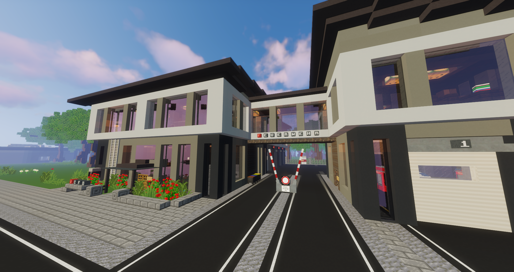

# Rettungsdienst

!!! info "Seiteninfo" 
      Diese Seite befindet sich noch im Aufbau. Der Beitrag ist daher noch **nicht vollständig!**
      
Der Rettungsdienst betreut und behandelt alle Spieler auf dem Server und trägt die Verantwortung einer stabilen mediznischen Versorgung und Gesundheitssystem. Sie führen Behandlungen durch, stellen Diagnosen, verschreiben Rezepte und retten auf der Straße jeden Tag die bewusstlosen Personen. Die Feuerwehr löscht Gewerbebrände und retten Personen aus dem Feuer. 

## Aufgaben
Der Rettungsdienst verfügt über verschiedene Möglichkeiten den Spielern auf dem Server zu helfen:

* Impfungen verabreichen
* Verstauchungen und Brüche schienen
* Röngtnen durchführen
* Rezepte gegen verschiedene Krankheiten ausstellen
* Bewusstlose Spieler wiederbeleben
* Blutanalysen und Operationen durchführen
* Notrufen nachgehen
* Gewerbebrände löschen

## Rettungsdienst-Equip

| Equipment | Funktion |
|:-:|:-:|
| Schiene | Behandlung verstauchte/gebrochene Beine |
| Leere Spritze | Impfungen und Blutabnahmen |
| Feuerlöscher | Feuer löschen |
| Pfefferspray | Selbstschutz des Personals |
| NaCl | Behandlung der [Dehydration](../../pages/krankheiten/dehydration.md) |
| Sprungtuch | Platzieren von Slimeblöcken |
| Feuerwehraxt | Einsatzgerät für Windbruch |

## Lage der medizinischen Gebäuden
Die Uniklinik ist der Hauptstandort des Rettungsdienst und ist erreichbar über die Bushaltestelle Uniklinik. Das, mit Ziegelsteinen gebaute, Gebäude liegt in der Nähe des Busses und direkt am Park. 

Der Rettungsdienst hat verteilt auf der Karte weitere Gebäude. Die Feuerwehrwache befindet sich ein paar Straßen weiter in Downtown. Ebenfalls ist der Rettungsdienst in Oststadt mit einer Rettungswache ausgerüstet.
Auf der Karte gibt es zwei weitere Krankenhäuser. Das Krankenhaus-Süd befindet sich im Reichenviertel und ist mit dem Bus "Reichenviertel" erreichbar und liegt in unmittelbarer Nähe zur Polizeistation-Süd. In Westside befindet sich das zweite Krankenhaus "Krankenhaus-West" und ist mit der Bushaltestelle "Westside" um die Ecke erreichbar.

