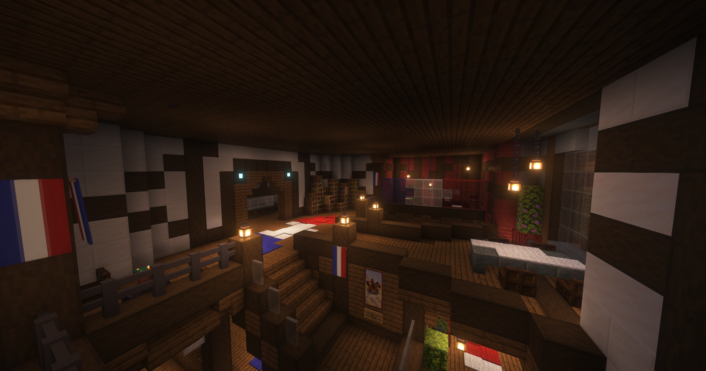

# Rousseau Familie

Die Rousseau Familie ist eine französische Gang, die einen Schmuggelhandel in der Stadt betreibt. Sie agiert und betreibt nebenbei eine Bäckerei in einer Markthalle. Die Gangmitglieder sind sehr territorial und pflegen kein gutes Verhältnis zu anderen Fraktionen. Solange die Polizei sich nicht in ihre Angelegenheiten einmischt, sind sie dieser nicht feindlich gestimmt.

## Hintergrundgeschichte 
Aktuell nicht verfügbar.

## Auftreten 

Die Familienmitglieder treten gemeinschaftlich auf und pflegen einen rauen Umgangston. Ihre Kleidung wird von den Farben Blau, Schwarz, Rot und Weiß bestimmt und die französische Flagge ist sichtbar. Innerhalb ihres Geschäftes in der "Boulangerie de la Rousseau" pflegen sie einen lockeren, geschäftlichen Umgang und sind territorial.

## Aktivitäten
Die Fraktion geht folgenden Aktivitäten nach:

* Herstellung und Verkauf von illegalen Betäubungsmitteln
* [Apothekenraub](apothekenraub.md)
* Bearbeitung von [Darklists](darklist.md)
* Bearbeitung von [Kopfgeldern](kopfgeld.md)
* Hackangriffe
* [Substanzendealer](substanzendealer.md) abfangen

## Lage des Hauptquartiers

Die Rousseau Familie besitzt eine Markthalle direkt am Marktplatz in der Altstadt. Diese Markthalle umfasst eine Fromagerie (Käsestand), ein Café (Kaffeestand), Fruits et Légumes (Obst- und Gemüsestand), eine Boucherie (Fleischerei) und eine Boulangerie (Bäckerei).