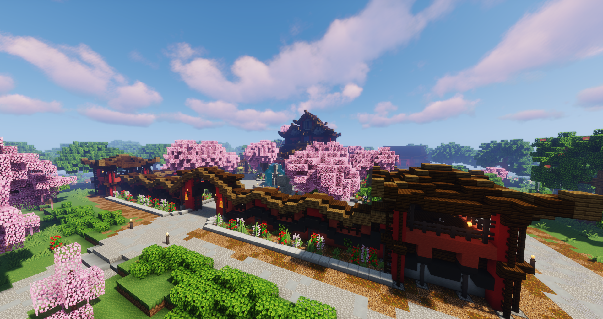

# Yakuza

Die Yakuza ist eine Mafia japanischer Herkunft. Sie agieren verdeckt in einer Kampfschule, welche sehr spirituell aufgebaut ist. Ihre Reinheit der Seele und die Harmonie mit den Geistern ist das höchste Gebot der Kampfschule. Kommt man ihnen zu nahe, werden sie gefährlich und schützen sich mit allen Mitteln.

## Hintergrundgeschichte 

Die Yakuza ist eine geheime Organisation aus dem Untergrund Japans. Sie orientiert sich zum Großteil an damaligen Ninja-Gruppen. Der Fokus der Gruppierung bezieht sich nicht auf Gewalt, sondern auf einen ausreichenden Lebenstil der Mitglieder der Kampfschule.

## Auftreten 

Die Yakuza tritt vor allem in höheren Positionen in seriösen dunkelroten Anzügen auf. Der Rest der Mitglieder sind Alltagstauglich gekleidet. Sie verhalten sich sehr seriös und friedlich gegenüber der Zivilisation. Sie sind wie Flamme, schön zu betrachten, aber gefährlich, wenn man zu nahe kommt.

## Aktivitäten
Die Fraktion geht folgenden Aktivitäten nach:

* Herstellung und Verkauf von illegalen Betäubungsmitteln
* Apothekenräuben
* Bearbeitung von Darklists
* Bearbeitung von Kopfgeldern
* Juwelenräuben
* Mohnfelder abbauen

## Lage des Hauptquartiers

Die Yakuza hat ihren Standort als Kampfschule im Asiaviertel.
