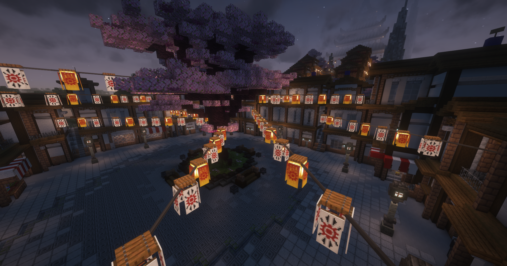

 

In Mitten blühender Sakura-Bäume liegt das Asiaviertel. Die charakteristischen rot-braunen Häuser und die gepflasterten Straßen laden zum flanieren in diesem Gebiet ein. Viele Geheminsse erwarten einen in den kleinen Seitengassen. Lass dich von den asiatischen Sitten und Gebräuchen verzaubern.

<table>
  <thead>
    <tr>
      <th colspan=2 align="center">Inhalte</th>
    </tr>
  </thead>
  <tbody>
    <tr>
      <td align="center">Haltestelle</td>
      <td align="center">Asiaviertel</td>
    </tr>
    <tr>
      <td align="center">Gewerbe</td>
      <td align="center"><a href="../../biz/supermarkt/">Supermarkt</a>-6   <a href="../../biz/waffenladen/">Waffenladen</a>-4   <a href="../../biz/tankstelle/">Tankstelle</a>-4   <a href="../../biz/apotheke/">Apotheke</a>-4</td>
    </tr>
    <tr>
      <td align="center">Öffentliche Orte</td>
      <td align="center"><a href="../../fraktionen/yakuza/">Yakuza</a> HQ   Freizeitpark</td>
    </tr>
    <tr>
      <td align="center">Nebenjobs</td>
      <td align="center">/</td>
  </tbody>
</table>
