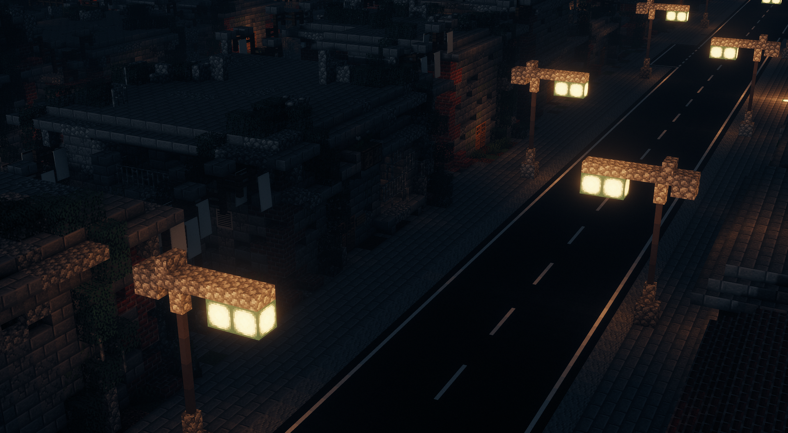
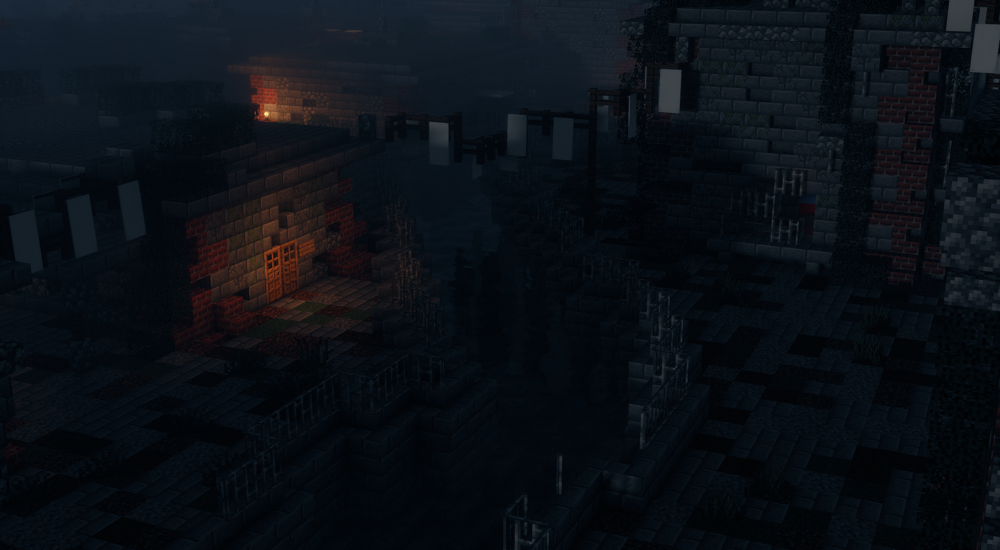

 

In Auheim herrschen noch grausame Sitten. Nur der Stärkste gewinnt. Gegliedert ist das Gebiet in Auheim und Auheim Süd. In Auheim Süd sind die Häuser sehr zerfallen. Sie sind undicht, kalt und in manchen Ecken schimmelt es schon. Aber immerhin sind die Häuser günstig. Auheim gehört der Volkov Familie, mit der man sich besser nicht anlegen sollte.

<table>
  <thead>
    <tr>
      <th colspan=2 align="center">Inhalte</th>
    </tr>
  </thead>
  <tbody>
    <tr>
      <td align="center">Haltestelle</td>
      <td align="center">Auheim   Auheim Süd</td>
    </tr>
    <tr>
      <td align="center">Gewerbe</td>
      <td align="center"><a href="../../biz/apotheke/">Apotheke</a>-6   <a href="../../biz/supermarkt/">Supermarkt</a>-8   <a href="../../biz/waffenladen/">Waffenladen</a>-5</td>
    </tr>
    <tr>
      <td align="center">Öffentliche Orte</td>
      <td align="center"><a href="../../gebäude/tierheim/">Tierheim</a>   Volkov Familie HQ</td>
    </tr>
    <tr>
      <td align="center">Nebenjobs</td>
      <td align="center"><a href="../../nebenjobs/munitionstransport/"> Munitionstransport </a></td>
    </tr>
  </tbody>
</table> 
