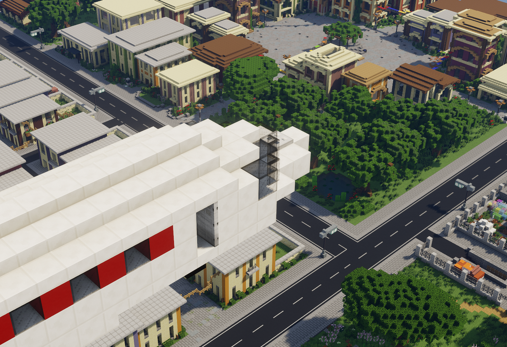

# County / Plaza

 

Das Gebiet County und der dazugehörige Plaza zeichnet sich durch die markanten Sandsteingebäude aus. Hier herrscht das kolumbianische <a href="../../fraktionen/kartell.md">Medellín kartell</a>. Umgeben von Agaven-Feldern und einer sehr mediterranen Bepflanzung liegt das County im westlichen Teil der Karte.

<table>
  <thead>
    <tr>
      <th colspan=2 align="center">Inhalte</th>
    </tr>
  </thead>
  <tbody>
    <tr>
      <td align="center">Haltestelle</td>
      <td align="center">County/Plaza</td>
    </tr>
    <tr>
      <td align="center">Gewerbe</td>
      <td align="center"> <a href="../../biz/supermarkt/">Supermarkt</a>-3   <a href="../../biz/bar.md">Bar</a>-2   <a href="../../biz/waffenladen/">Waffenladen</a>-2   <a href="../../biz/tankstelle/">Tankstelle</a>-2 </td>
    </tr>
    <tr>
      <td align="center">Öffentliche Orte</td>
      <td align="center"><a href="../../gebäude/handelshaus.md">Handelshaus</a></td>
    </tr>
    <tr>
      <td align="center">Nebenjobs</td>
      <td align="center"><a href="../../nebenjobs/imker.md">Imker</a>   <a href="../../nebenjobs/honigtransport.md">Honigtransport</a>   <a href="../../nebenjobs/agavenfarmer.md">Agavenfarmer</a></td>
  </tbody>
</table>
