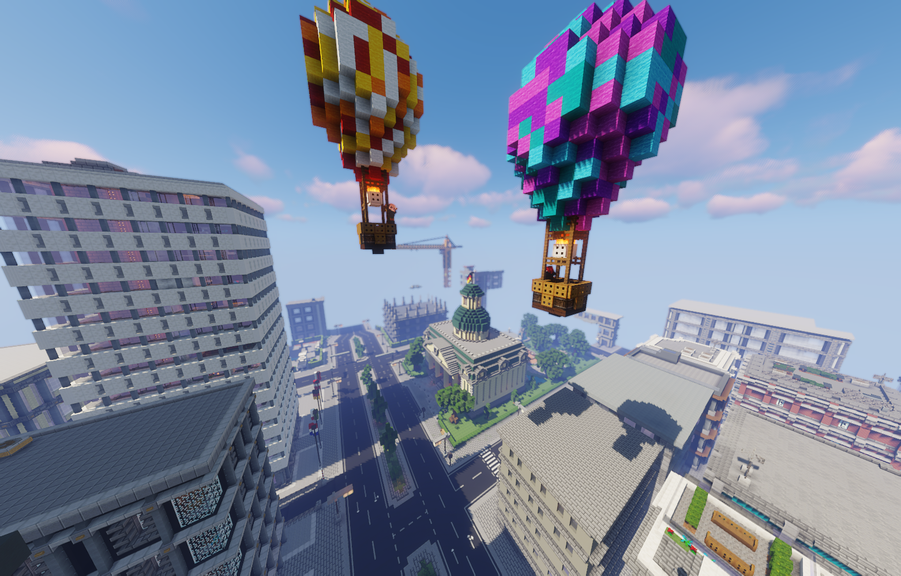

# Downtown

 

Downtown bildet das Herzstück von Vance City. Das Zentrum der Stadt besteht aus Hochhäusern, in welchen sich unzählige Büros und Apartments befinden sowie auch die meisten spielrelevanten Gebäude.

<table>
  <thead>
    <tr>
      <th colspan=2 align="center">Inhalte</th>
    </tr>
  </thead>
  <tbody>
    <tr>
      <td align="center">Haltestelle</td>
      <td align="center"><a href="../../fraktionen/rettungsdienst.md">Uniklinik</a>   Postzentrale </td>
    </tr>
    <tr>
      <td align="center">Gewerbe</td>
      <td align="center"><a href="../../biz/apotheke.md">Apotheke</a>-1   <a href="../../biz/starblocks.md">Starblocks</a>-1   <a href="../../biz/bar.md">Bar</a>-3</td>
    </tr>
    <tr>
      <td align="center">Öffentliche Orte</td>
      <td align="center">Makler   <a href="../../orte/stadthalle.md">Stadthalle</a>   <a href="../../fraktionen/rettungsdienst.md">Uniklinik</a>   <a href="../../orte/zentralbank.md">Zentralbank</a>   <a href="../../fraktionen/polizei.md">Polizei</a> HQ   <a href="../../orte/rathaus.md">Rathaus</a></td>
    </tr>
    <tr>
      <td align="center">Nebenjobs</td>
      <td align="center"><a href="../../nebenjobs/paketsortierer.md">Paketsortierer</a>   <a href="../../nebenjobs/wäscherei.md">Wäscherei</a>   <a href="../../nebenjobs/zeitungsjunge.md">Zeitungsjunge</a>   Koch   <a href="../../nebenjobs/wäschetransport.md">Wäschetransport</a>   <a href="../../nebenjobs/straßenreiniger.md">Straßenreiniger</a>   <a href="../../nebenjobs/tellerwäscher.md">Tellerwäscher</a>   <a href="../../nebenjobs/geldtransport.md">Geldtransport</a>   <a href="../../nebenjobs/blumentransport.md">Blumentransport</a>   <a href="../../nebenjobs/jvatransport.md">JVA-Transport</a></td>
    </tr>
  </tbody>
</table> 
