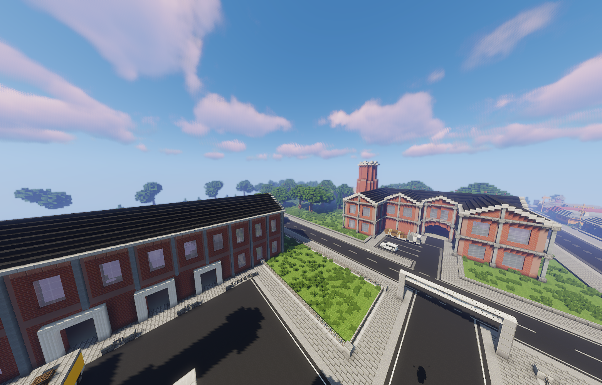
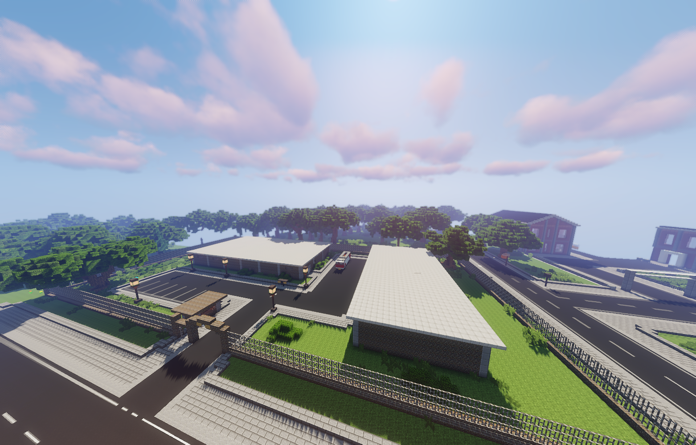

 

Im Ganggebiet herrschen noch grausame Sitten. Nur der Stärkste gewinnt. Gegliedert ist das Gebiet in das Ganggebiet und das Ganggebiet Nord. Im Ganggebiet Nord sind die Häuser sehr zerfallen. Sie sind undicht, kalt und in manchen Ecken schimmelt es schon. Aber immerhin sind die Häuser günstig. Das Ganggebiet gehört der Raven Familia, mit der man sich besser nicht anlegen sollte.

<table>
  <thead>
    <tr>
      <th colspan=2 align="center">Inhalte</th>
    </tr>
  </thead>
  <tbody>
    <tr>
      <td align="center">Haltestelle</td>
      <td align="center">Ganggebiet   Ganggebiet Nord</td>
    </tr>
    <tr>
      <td align="center">Gewerbe</td>
      <td align="center"><a href="../../biz/apotheke.md">Apotheke</a>-2   <a href="../../biz/supermarkt.md">Supermarkt</a>-5   <a href="../../biz/waffenladen.md">Waffenladen</a>-3</td>
    </tr>
    <tr>
      <td align="center">Öffentliche Orte</td>
      <td align="center"><a href="../../gebäude/tierheim.md">Tierheim</a>   Raven Familia HQ</td>
    </tr>
    <tr>
      <td align="center">Nebenjobs</td>
      <td align="center"><a href="../../nebenjobs/jvatransport.md">JVA-Transport</a>   <a href="../../nebenjobs/fensterputzer.md">Fensterputzer</a>   <a href="../../nebenjobs/munitionstransport.md">Munitionstransport</a>   <a href="../../nebenjobs/erztransport.md">Erztransport</a></td>
    </tr>
  </tbody>
</table> 
