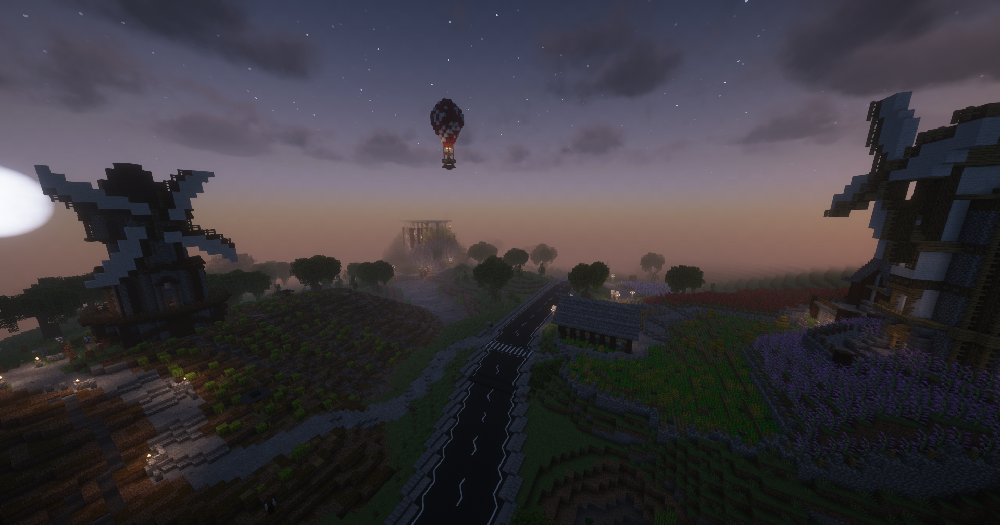

# Oststadt

 

Die Oststadt ist ein kleines, ruhiges Wohnviertel, das überwiegend aus farbigen Einfamilienhäusern besteht. Die Oststadt liegt gleich neben Downtown und zählt somit zu den zentralen Gebieten der Stadt. Das Viertel zeichnet sich durch seine gepflegte Art und die schön bepflanzten Gärten aus.

<table>
  <thead>
    <tr>
      <th colspan=2 align="center">Inhalte</th>
    </tr>
  </thead>
  <tbody>
    <tr>
      <td align="center">Postleitzahl</td>
      <td align="center">74902</td>
    </tr>
    <tr>
      <td align="center">Haltestelle</td>
      <td align="center">Oststadt</td>
    </tr>
    <tr>
      <td align="center">Gewerbe</td>
      <td align="center"><a href="../../biz/supermarkt/">Supermarkt</a> 1 & 4   <a href="../../biz/bar/">Bar</a>-1   <a href="../../biz/waffenladen/">Waffenladen</a>-1   Gärtnerei</td>
    </tr>
    <tr>
      <td align="center">Öffentliche Orte</td>
      <td align="center"><a href="../../fraktionen/rettungsdienst/">Rettungswache</a>   Spielplatz   Restaurant</td>
    </tr>
    <tr>
      <td align="center">Nebenjobs</td>
      <td align="center"><a href="../../nebenjobs/winzer/">Winzer</a>   <a href="../../nebenjobs/farmer/">Farmer</a>   <a href="../../nebenjobs/blumentransport/">Blumentransport</a>   <a href="../../nebenjobs/getränketransport/">Getränketransport</a>   <a href="../../nebenjobs/gärtner/">Gärtner</a>   <a href="../../nebenjobs/jagd/">Jagd</a></td>
    </tr>
  </tbody>
</table>
