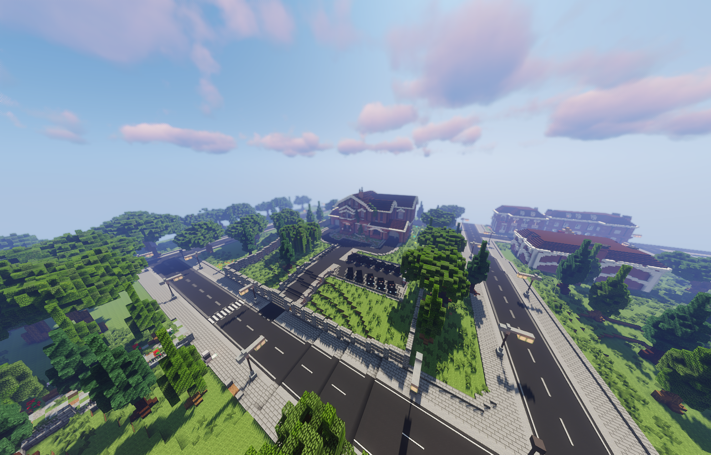
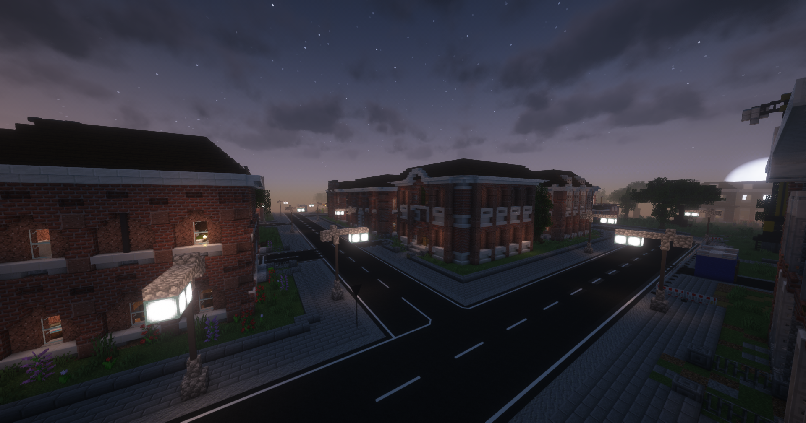

 

Die markanten Backsteinhäuser im Reichenviertel stechen jedem sofort ins Auge. Hier herrschen die Camorra. Es ist normalerweise eine ruhige Gegend, doch im verborgenen geschehen die haarsträubendsten Dinge.

<table>
  <thead>
    <tr>
      <th colspan=2 align="center">Inhalte</th>
    </tr>
  </thead>
  <tbody>
    <tr>
      <td align="center">Haltestelle</td>
      <td align="center">Reichenviertel</td>
    </tr>
    <tr>
      <td align="center">Gewerbe</td>
      <td align="center">Supermarkt-2   Apotheke-3</td>
    </tr>
    <tr>
      <td align="center">Öffentliche Orte</td>
      <td align="center">Camorra HQ   Pizzeria   Bank</td>
    </tr>
    <tr>
      <td align="center">Nebenjobs</td>
      <td align="center">/</td>
    </tr>
  </tbody>
</table>
