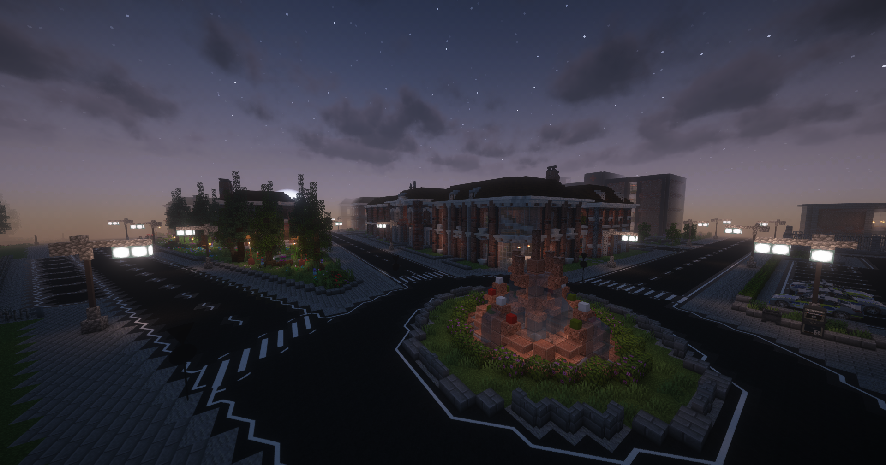

# Reichenviertel

 

Die markanten Backsteinhäuser im Reichenviertel stechen jedem sofort ins Auge. Hier herrscht die <a href="../../fraktionen/camorra/">Camorra</a>. Es ist normalerweise eine ruhige Gegend, doch im Verborgenen geschehen die haarsträubendsten Dinge.

<table>
  <thead>
    <tr>
      <th colspan=2 align="center">Inhalte</th>
    </tr>
  </thead>
  <tbody>
      <tr>
      <td align="center">Postleitzahl</td>
      <td align="center">74903</td>
    </tr>
    <tr>
      <td align="center">Haltestelle</td>
      <td align="center">Reichenviertel</td>
    </tr>
    <tr>
      <td align="center">Gewerbe</td>
      <td align="center"><a href="../../biz/supermarkt/">Supermarkt</a>-2   <a href="../../biz/apotheke/">Apotheke</a>-3</td>
    </tr>
    <tr>
      <td align="center">Öffentliche Orte</td>
      <td align="center"><a href="../../fraktionen/camorra/">Camorra</a> HQ   Pizzeria   Bank</td>
    </tr>
    <tr>
      <td align="center">Nebenjobs</td>
      <td align="center"><a href="../../nebenjobs/sägewerk/">Sägewerk</a>   <a href="../../nebenjobs/pizzabäcker/">Pizzabäcker</a></td>
    </tr>
  </tbody>
</table>
