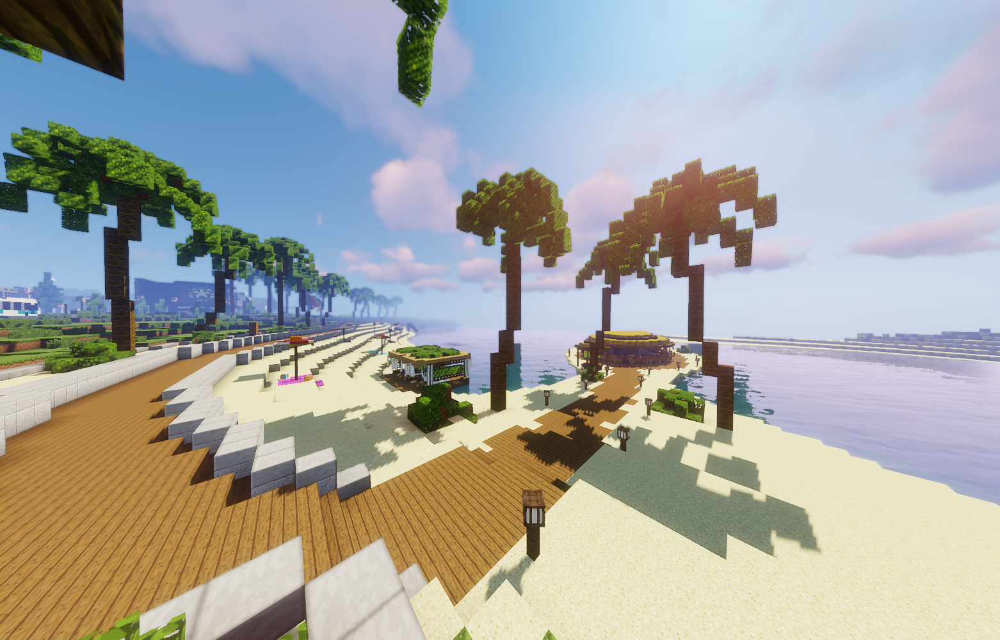

# Strandpassage

 

Eine kleine, unscheinbare und ruhige Gegend. In den modernen Villen in dieser Straße wohnen die Reichen und Schönen der Stadt. Hier befinden sich die größten und teuersten Villen der Stadt mit Direktzugang zum Strand.

<table>
  <thead>
    <tr>
      <th colspan=2 align="center">Inhalte</th>
    </tr>
  </thead>
  <tbody>
       <tr>
      <td align="center">Postleitzahl</td>
      <td align="center">74904</td>
    </tr>
    <tr>
      <td align="center">Haltestelle</td>
      <td align="center">Strandpassage</td>
    </tr>
    <tr>
      <td align="center">Gewerbe</td>
      <td align="center"><a href="../../biz/starblocks/">Starblocks</a>-2</td>
    </tr>
    <tr>
      <td align="center">Öffentliche Orte</td>
      <td align="center">Strand</td>
    </tr>
    <tr>
      <td align="center">Nebenjobs</td>
      <td align="center"><a href="../../nebenjobs/bademeister/">Bademeister</a></td>
    </tr>
  </tbody>
</table>
