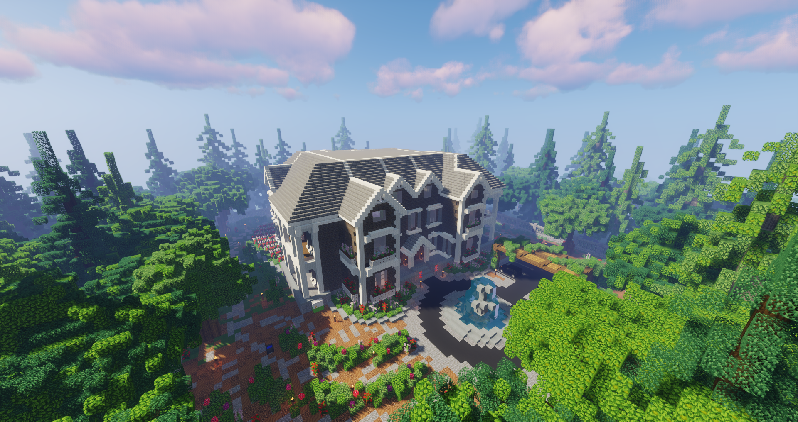
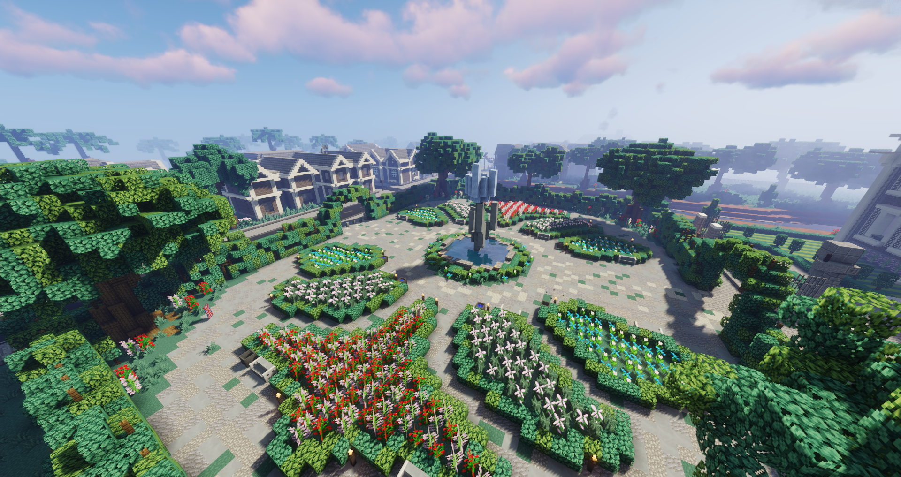

# Westside

 

An das Land England angelehnt, bringt das Viertel drei Gewerbe mit sich und ist Standort des Luxusfahrzeughändlers. Das Viertel hat einen kleinen Strandabschnitt und ins Auge fällt ein größeres Gebäude, das dem [The Establishment](../../pages/fraktionen/establishment.md) gehört. In der Mitte des Gebietes ist ein alter Marktplatz und kennzeichnet somit die Ortsmitte.

<table>
  <thead>
    <tr>
      <th colspan=2 align="center">Inhalte</th>
    </tr>
  </thead>
  <tbody>
      <tr>
      <td align="center">Postleitzahl</td>
      <td align="center">74907</td>
    </tr>
    <tr>
      <td align="center">Haltestelle</td>
      <td align="center">Westside</td>
    </tr>
    <tr>
      <td align="center">Gewerbe</td>
      <td align="center"><a href="../../biz/apotheke/">Apotheke</a>-5   <a href="../../biz/tankstelle/">Tankstelle</a>-5   <a href="../../biz/supermarkt/">Supermarkt</a>-7</td>
    </tr>
    <tr>
      <td align="center">Öffentliche Orte</td>
      <td align="center">Marktplatz   Luxusfahrzeughändler</td>
    </tr>
    <tr>
      <td align="center">Nebenjobs</td>
      <td align="center">/</td>
    </tr>
  </tbody>
</table>

