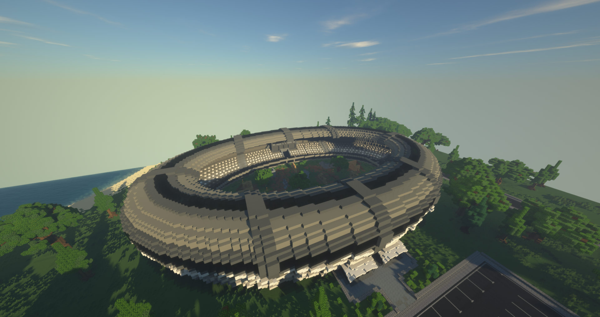

# Fight Club

Der Fight Club bietet den Spielern die Möglichkeit, sich mit Waffen zu duellieren. Das Besondere: Nach dem Tod wird man sofort wiederbelebt und verliert kein Charakterleben. Der Fight Club ist mit dem Bus über die [Haltestelle](../../pages/öpnv/bus.md) [Reichenviertel](../../pages/gebiete/reichenviertel.md) zu erreichen. Die Arena hat eine eigene [U-Bahn](../../pages/öpnv/ubahn.md)-Station. Zutritt erhält man über den Befehl am Eingang der Arena. Der Zutritt ist kostenlos.

!!! info "Kein Zutritt bei WPS"
    Wenn man [Fahndungspunkte](../../pages/allgemein/fahndungspunkte.md) hat, kann man den Fight Club nicht betreten.

## Waffen
Die Waffen werden vom Fight Club zur Verfügung gestellt. Betritt man die Arena, werden die Waffen automatisch ins Inventar gelegt. Man wird mit einer [P51](../../pages/items/weapons/pistole.md), [MX8](../../pages/items/weapons/maschinenpistole.md), [Havok-47](../../pages/items/weapons/sturmgewehre.md) und einem Messer ausgestattet. Die Waffen und die darin befindliche Munition verschwinden beim Verlassen des Fight Clubs.

## Munition
Die Waffen sind einmalig geladen. Um nachzuladen, muss man eigene Munition mitbringen. Diese kann in den [Waffenläden](../../pages/biz/waffenladen.md) der Stadt käuflich erworben werden.

## Heilung
Vom Fight Club bekommt man 64 Bandagen. [Schmerzmittel](../../pages/bmt/schmerzmittel.md) oder [Heilkraut](../../pages/bmt/heilkraut.md) müssen selbst gekauft werden.

Die Arena kann mit dem Befehl **/fightclub leave** verlassen werden.

## Befehle

| Befehl | Nutzen | 
|:-:|:-:|
| /fightclub | Betritt den Fight Club |
| /fightclub (in der Arena) | Zeigt deine Statistik an |
| /fightclub info | Zeigt die Befehlsliste |
| /fightclub top | Zeigt die Bestenliste der Top Drei an |
| /fightclub leave | Verlässt die Arena |
