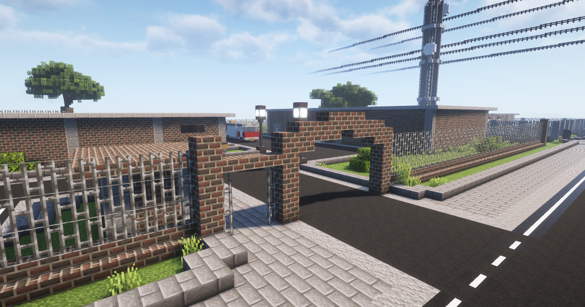

# Labor

Das Labor bietet die Möglichkeit für Crimefraktionen das, durch den [Apothekenraub](../../pages/fraktionen/apothekenraub.md) erhaltene, Tablettenschachteln zu Novapulver zu verarbeiten. Daher ist das Labor ein beliebter Ort für Crimefraktionen.

## Lage
Das Labor ist ein dunkles Ziegelsteingebäude und befindet sich am Rand des [Ganggebietes](../../pages/gebiete/ganggebiet.md). Das Labor kann ebenfalls mithilfe von /navi Labor gefunden werden. 

## Novapulver herstellen
Für das Herstellen von Novapulver werden Tablettenschachteln benötigt. Um den Prozess zu starten, muss der Braustand im hinteren Teil des Labors angeklickt und die Eingabe bestätigt werden. 

Die Verarbeitung der Tablettenschachteln dauert zwei Minuten. Nach Ablauf der Wartezeit wird das Novapulver in die Tasche des Herstellers, ungeachtet der freien Slots, hinzugefügt.

## Mohnkapseln herstellen
Für das Herstellen von Mohnkapseln wird 64x Mohnextrakt benötigt. Um den Prozess zu starten, muss der Braustand im hinteren Teil des Labors angeklickt und die Eingabe bestätigt werden. Nach erfolgreicher Verarbeitung wird das Opium in die Tasche des Herstellers, ungeachtet der freien Slots, hinzugefügt.
