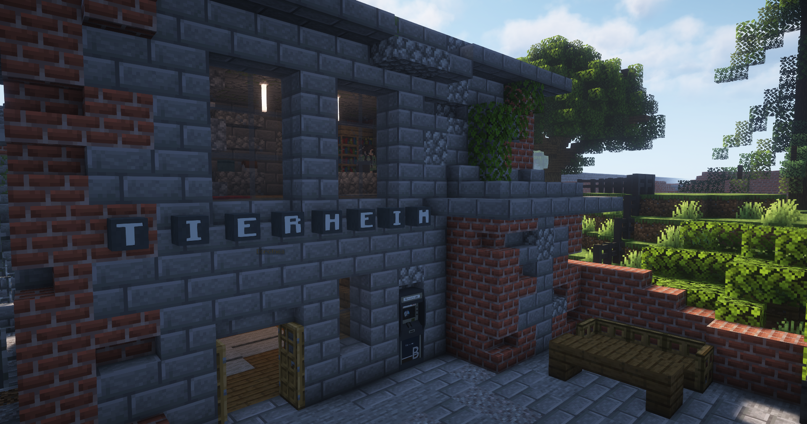

# Tierheim

  

Das Tierheim erreichst du über die Bushaltestelle Gangebiet, welche sich in unmittelbarer Nähe befindet. Der Befehl **/navi Tierheim** zeigt die genaue Richtung an.
Im Tierheim können Pets verbessert werden, verkauft werden oder gekauft werden bei zwei verschiedenen NPC's.

# Dorothea

Bei Dorothea kann das Tier mit einem Petupgrade, welches beim Schwarzmarkt oder Handelshaus gekauft werden kann, verbessert werden. Das Tier und das Petupgrade werden dann in das menü reingelegt zum Verbessern.

# Kate

Im Tierheim kann man Tierfutter (EG) und drei verschiedene Pets (1.OG) kaufen. Das sind die [Katze](../../pages/pets/katze.md), der [Hund](../../pages/pets/hund.md) & der [Papagei](../../pages/pets/papagei.md).

| Tier | Kaufkosten | Verkauf (Gewöhnlich) | Verkauf (Ungewöhnlich) | Verkauf (Selten) | Verkauf (Episch) | Verkauf (Legendär) | Verkauf (Ultralegendär) |
|:-:|:-:|:-:|:-:|:-:|:-:|:-:|:-:|
| Katze | 1.600,00€ | 500,00€ | 1000,00€ | 1.500,00€ | 4.666,67€ | 7.833,33€ | 11.000,00€ |
| Hund | 5.000,00€ | 1.666,67€ | 2166,66€ | 2.666,67€ | 5.833,33€ | 9.000,0€ | 12.166,67€ |
| Papagei | 7.200,00€ | 2.400,00€ | 2900,00€ | 3.400,00€ | 6.566,67€ | 9733,33€ | 12.900,00€ |
| Hase | / | 616,67€ | 1116,67€ | 1616,67€ | 4783,33€ | 7.950,0€ | 11.116,67€ |
| Capybara | / | 1666,67€ | 2166,67€ | 2.666,67€ | 5.833,33€ | 9000,00€ | 12.166,67€ |
| Biene | / | 1666,67€ | 2166,67€ | 2.666,67€ | 5833,33€| 9.000,00€ | 12.166,67€ |
| Affe | / | 1666,67€ | 2166,67€ | 2.666,67€ | 5833,33€ | 9.000,00€ | 12.166,67€ |
| Rentier | / | 1666,67€ | 2166,67€ | 2.666,67€ | 5833,33€ |9.000,00€ | 12.166,67€ |
| Fledermaus | / | 900,00€ | 1400,00€ | 1.900,00€ | 5066,67€ | 8.233,33€ | 11.400,00€ |

Im 1. OG kann man beim NPC Kate drei unterschiedliche Pets erwerben. Ebenfalls bietet sich hier die Gelegenheit das Pet zu verbessern auf die Stufen **Ungewöhnlich** und **Selten**. Und so funktioniert es:

1. Das Pet ins Inventar nehmen
2. Kate anklicken
3. Den Amboss "Tierseltenheit" auswählen.
4. Das Pet auf das freie Feld über dem Amboss ziehen und auf den Amboss klicken.
