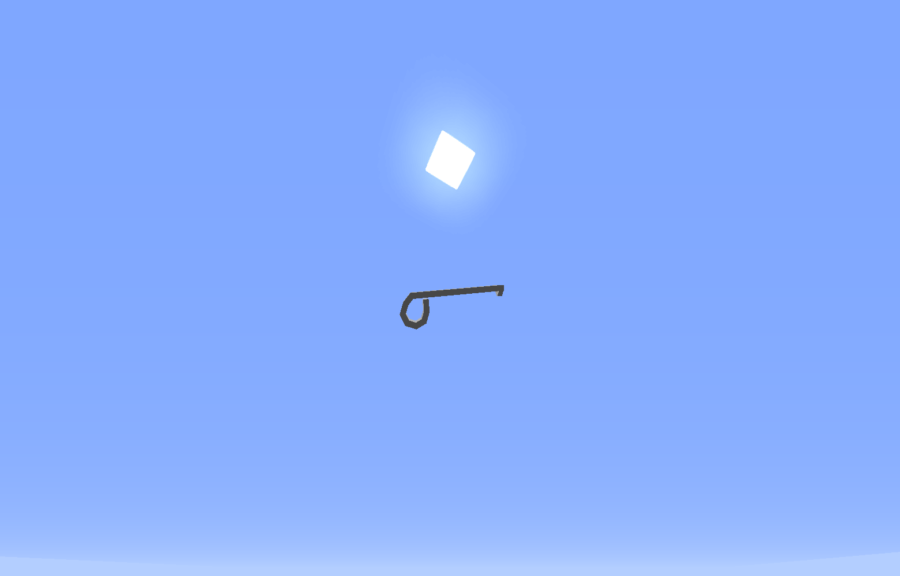

# Dietrich

Ein Dietrich ist ein Werkzeug, mit dem Türen von Häusern und Fraktionsbasen aufgebrochen werden können.  

## Kauf
Ein Dietrich kann in der [Schwarzmarktauktion](../../pages/orte/schwarzmarkt.md) für 300€ gekauft werden.

## Verwendung
Mit einem Dietrich kann einem Zugang zu Häusern und Fraktionsbasen geschaffen werden, in denen zum Beispiel eine Person mit [Kopfgeld](../../pages/fraktionen/kopfgeld.md) befindet.

