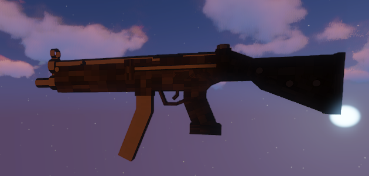

# MX8
Die MX8 ist eine von fünf Schusswaffen, welche es auf dem Server gibt. 
Die MX8 ist eine Schnellschusswaffe, für die das kleine Magazin benötigt wird. Ihr Magazin umfasst 25 Schuss. Desweiteren kann die Waffe mit Waffenaddons ausgestattet werden.  

## Erhalten einer MX8
Die MX8 kann in [Waffenläden](../../biz/waffenladen.md) gekauft werden. Der Preis hängt von dem jeweiligen Waffenladen ab. Voraussetzung hierfür ist eine Waffenlizenz, welche in der [Stadthalle](../../orte/stadthalle.md) beantragt wird. Die Munition wird ebenfalls in den Waffenläden verkauft.

## Verwendung 
Die MX8 wird in Schießereien gebraucht, um sich selbst zu verteidigen. Die Waffe verursacht an Spielern einen Schaden von 2,5 ❤️.
