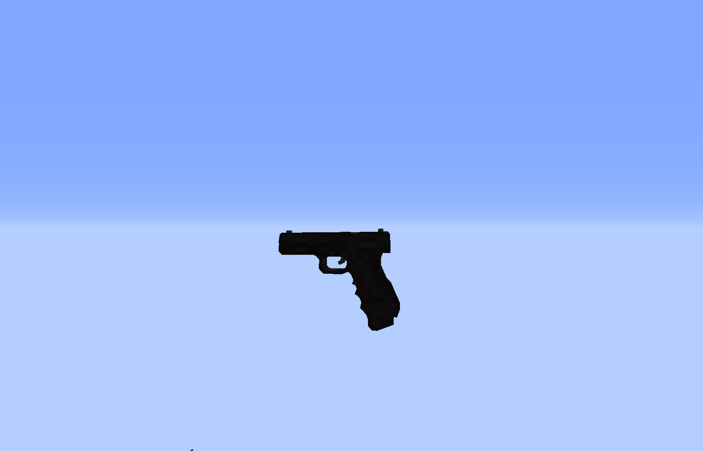

# P-51
Die P-51 ist eine von fünf Schusswaffen, welche es auf dem Server gibt.
Die P-51 ist eine Handschusswaffe, für die das kleine Magazin benötigt wird. Ihr Magazin umfasst 15 Schuss. Desweiteren kann die Waffe mit Waffenaddons ausgestattet werden.  

## Erhalten einer P-51
Die P-51 kann in [Waffenläden](../../biz/waffenladen.md) gekauft werden. Der Preis hängt von dem jeweiligen Waffenladen ab. Voraussetzung hierfür ist eine Waffenlizenz, welche in der [Stadthalle](../../orte/stadthalle.md) beantragt wird. Die Munition wird ebenfalls in den Waffenläden verkauft.

## Verwendung
Die P-51 wird gebraucht um sich selbst zu verteidigen. Die Waffe verursacht an Spielern einen Schaden von 2 ❤️.
